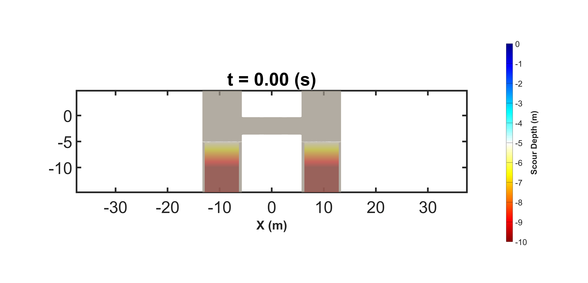

# 0. 成果展示
！ 要記得修改 GIF 時間然後轉成影片檔
## Buoy-Wave Interaction
[浮標隨波性模擬](Truchas_Lab/II.%20Truchas/A.%20成果合輯/浮標隨波性模擬.md)

|  |  |
| --------------------------- | ---------------------------------------------------------- |

---
## Guishan Island Lanslide
[龜山島山崩海嘯](Truchas_Lab/II.%20Truchas/A.%20成果合輯/龜山島山崩海嘯.md)

|  |  |
| ----------------------------------- | ---------------------------------- |

---
## Guandu Bridge Local Scour
[關渡橋局部沖刷](Truchas_Lab/II.%20Truchas/A.%20成果合輯/關渡橋局部沖刷.md)

|  |  |
| --------------------------- | --------------------------- |

# 1. 相關研究進度在 Truchas_Lab 裡面。

# 2. 部分排版錯誤
- 由於 Github 幾年前取消了 Markdown 語法中對部分排版的支援，網頁上看到的文字及圖片其位置、顏色、大小可能無法正確呈現。
- 可以直接下載 md 檔然後用 VS CODE 或是 Obsidian (建議) 開啟觀看。

# 3. 頁面跳轉錯誤
- 頁面跳轉有時候不精確，要根據上下文或是網址末端標註的位置來尋找。
- 例如跳轉後網址是 `https://github.........md#turn-40` ，表示要找第 Turn 40 的問答。

# 4. 資料夾說明

- Truchas_Lab：研究進度
- 筆記自動上傳測試：測試用
- 模版 Templates：筆記模版
- .github：Github 相關功能
- .gitignore：上傳時要忽略的檔案
- .smart-env：擴充功能 smart-connection
- .trash：廢棄資料
- consistency-report.md：引用連結檢查
- copilot：Obsidian 聯動 AI 助手的聊天紀錄
- pics：當層路徑下各筆記的附件（圖片、GIF、MP4 ...）