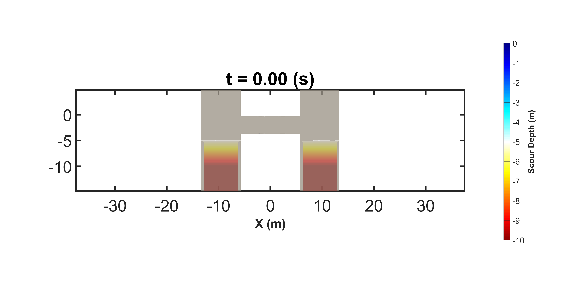

# 0. Truchas Lab Research Showcase

## Buoy-Wave Interaction
[_Method: VFIFE (Vector Form Intrinsic Finite Element) ](Truchas_Lab/II.%20Truchas/A.%20Research%20Results/浮標隨波性模擬.md)

|  |  |
| --------------------------- | ---------------------------------------------------------- |


---
## Guishan Island Lanslide
[_Method: DBM (Discontinuous Bi-viscous Model) ](Truchas_Lab/II.%20Truchas/A.%20Research%20Results/龜山島山崩海嘯.md)

|  |  |
| ----------------------------------- | ---------------------------------- |

---
## Guandu Bridge Local Scour
[_Method: DBM (Discontinuous Bi-viscous Model)  ](Truchas_Lab/II.%20Truchas/A.%20Research%20Results/關渡橋局部沖刷.md)

|  |  |
| --------------------------- | --------------------------- |


# 1. Research Progress
All related research progress, updates, and simulation logs can be found in the `Truchas_Lab` directory.

# 2. Rendering & Layout Compatibility
- Due to updates in GitHub's Markdown rendering engine, certain legacy inline styling (such as custom text positioning, colors, and specific image dimensions) may not display correctly directly on Github.  
	  > **Recommended Viewing:** For optimal formatting and full styling support, please clone or download the repository and view the `.md` files using **Obsidian** (Recommended) or **VS Code**.

# 3. Anchor Navigation & Deep Linking
- Some internal page jump links (anchors) may not land precisely on the target header due to Markdown rendering differences.
- If the navigation falls short, please check the target section anchor in the URL bar (e.g., `#turn-40`) and locate the corresponding section manually (e.g., search for **Turn 40** in the text).


# 4. Directory Structure

```text
.
├── Excalidraw/
│   └── pics/
├── LongForm/
│   └── 論文大綱_V01/
├── Note Templates/
├── Note Test/
│   └── pics/
├── pics/
├── tmp/
│   └── pics/
└── Truchas_Lab/
    ├── I. Research Tools/
    │   ├── A. Softwares 推薦軟體/
    │   ├── B. Weasel 小狼毫輸入法/
    │   ├── C. Code Editor 程式編輯器/
    │   └── D. AI Tools  AI 工具/
    ├── II. Truchas/
    │   ├── A. Research Results/
    │   ├── B. VFIFE/
    │   ├── C. Truchsa-WSL/
    │   └── D. 160-Truchas-2.5.3/
    └── III. COMCOT/

```

# 5. Timeline


