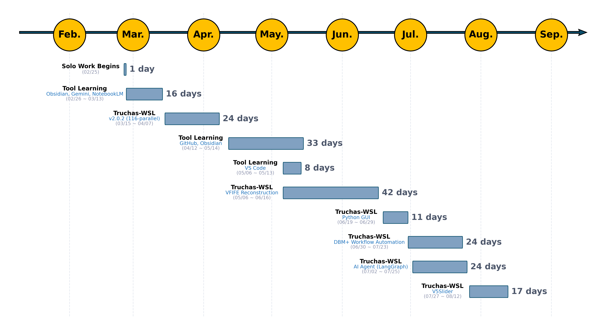

#  Truchas Lab Research Showcase

### Buoy-Wave Interaction
[_Method: VFIFE (Vector Form Intrinsic Finite Element) ](Truchas_Lab/II.%20Truchas/A.%20Research%20Results/浮標隨波性模擬.md)

|  |  |
| --------------------------- | --------------------------- |
|                             |                             |

### Guishan Island Lanslide
[_Method: DBM (Discontinuous Bi-viscous Model) ](Truchas_Lab/II.%20Truchas/A.%20Research%20Results/龜山島山崩海嘯.md)

|  |  |
| ----------------------------------- | ---------------------------------- |


### Guandu Bridge Local Scour
[_Method: DBM (Discontinuous Bi-viscous Model)  ](Truchas_Lab/II.%20Truchas/A.%20Research%20Results/關渡橋局部沖刷.md)

|  |  |
| --------------------------- | --------------------------- |

---

# Release Structure

This repository contains multiple research components and experimental environments. Please refer to the directory below to find and download the corresponding source code, pre-built environments, or data tools.

### 🐧 WSL & Virtualization Environments
*   ** `[WSL-LXD]` Linux Containers Setup** 
    *   *Description:* Advanced virtualization environment configuration for Truchas.
    *   *Latest Download:* [👉 Release Link](https://github.com/slider60213/Truchas-notes-auto-sync-Public-/releases/tag/Truchas-WSL)
*   ** `[WSL-GUI]` Graphical Interface**
    *   *Description:* GUI integration for managed Truchas-WSL workflows.
    *   *Latest Download:* [👉 Release Link](https://github.com/slider60213/Truchas-notes-auto-sync-Public-/releases/tag/Truchas-WSL-GUI)
*   ** `[WSL-Only]` Core WSL Environment**
    *   *Description:* Basic WSL setup and initialization scripts for research replication.
    *   *Latest Download:* [👉 Release Link](https://github.com/slider60213/Truchas-notes-auto-sync-Public-/releases/tag/Truchas-WSL-only)
*   ** `[LXD-Only]` LXD Environment**
    *   *Description:* Standalone LXD container configurations designed to be integrated and combined with the WSL environment.
    *   *Latest Download:* [👉 Release Link](https://github.com/slider60213/Truchas-notes-auto-sync-Public-/releases/tag/Truchas-WSL-LXD)

### 🤖 Core Agents & Utilities
*   ** `[WSL-Agent]` Communication Agent**
    *   *Description:* Background daemon managing host-to-guest communications.
    *   *Latest Download:* [👉 Release Link](https://github.com/slider60213/Truchas-notes-auto-sync-Public-/releases/tag/Truchas-WSL-agent)

### 📊 Data Processing & Analysis (Matlab)
*   ** `[Matlab] GMV Plotter` **
    *   *Description:* Post-processing toolbox utilized for plotting and analyzing GMV simulation data.
    *   *Latest Download:* [👉 Release Link](https://github.com/slider60213/Truchas-notes-auto-sync-Public-/releases/tag/Matlab-GMV_Plotter)

---

# Directory Structure

```text
.
├── Excalidraw/
│   └── pics/
├── LongForm/
│   └── 論文大綱_V01/
├── Note Templates/
├── Note Test/
│   └── pics/
├── pics/
├── tmp/
│   └── pics/
└── Truchas_Lab/
    ├── I. Research Tools/
    │   ├── A. Softwares 推薦軟體/
    │   ├── B. Weasel 小狼毫輸入法/
    │   ├── C. Code Editor 程式編輯器/
    │   └── D. AI Tools  AI 工具/
    ├── II. Truchas/
    │   ├── A. Research Results/
    │   ├── B. VFIFE/
    │   ├── C. Truchsa-WSL/
    │   └── D. 160-Truchas-2.5.3/
    └── III. COMCOT/

```

---

#  Timeline of Repo




---

# FYI: 
## Rendering & Layout Compatibility
- Due to updates in GitHub's Markdown rendering engine, certain legacy inline styling (such as custom text positioning, colors, and specific image dimensions) may not display correctly directly on Github.  
	  > **Recommended Viewing:** For optimal formatting and full styling support, please clone or download the repository and view the `.md` files using **Obsidian** (Recommended) or **VS Code**.

## Anchor Navigation & Deep Linking
- Some internal page jump links (anchors) may not land precisely on the target header due to Markdown rendering differences.
- If the navigation falls short, please check the target section anchor in the URL bar (e.g., `#turn-40`) and locate the corresponding section manually (e.g., search for **Turn 40** in the text).