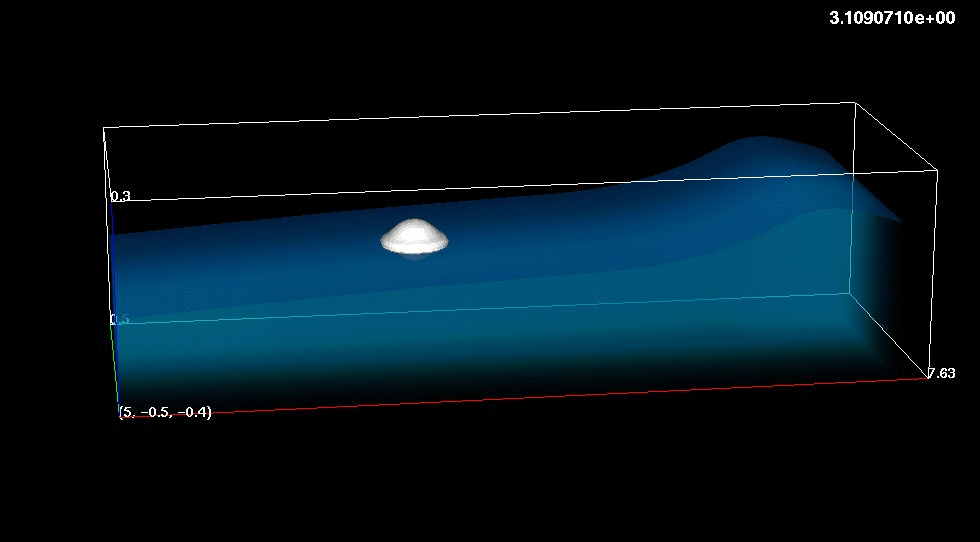
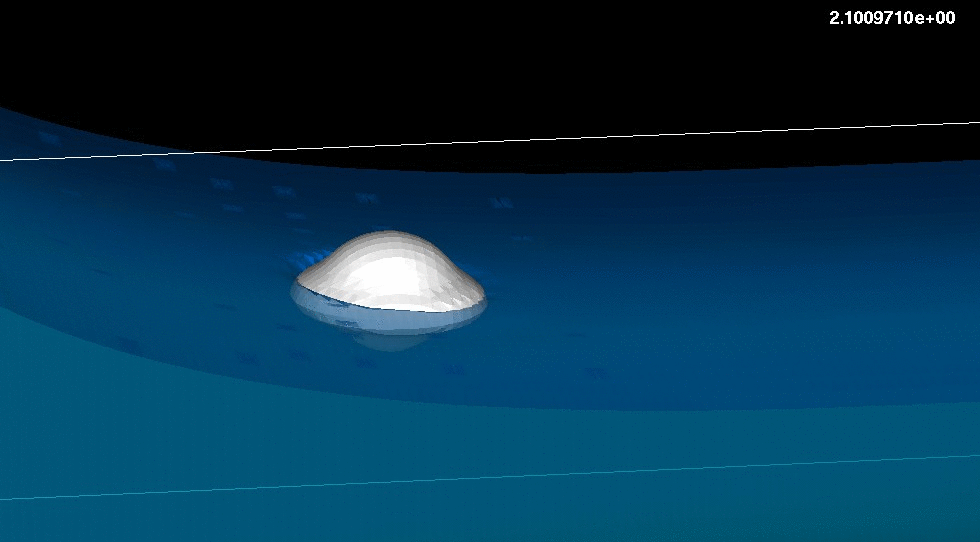
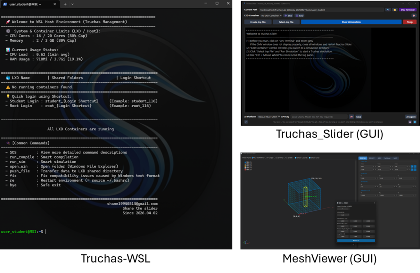

# 1. Truchas Lab Research Showcase

### 1.1.1. Buoy-Wave Interaction
[Method: VFIFE (Vector Form Intrinsic Finite Element) ](Truchas_Lab/II.%20Truchas/A.%20Research%20Results/Buoy-Wave%20Interaction.md)

|  |  |
| ------------------------------ | --------------------------------- |

### 1.1.2. Tuchas Slider (GUI with MeshViewer for Trucahs-WSL)
* Tutorial Video: [👉 Youtube](https://youtu.be/2wgxBXZuq6M)
  

### 1.1.3. Guishan Island Lanslide
[Method: DBM (Discontinuous Bi-viscous Model) ](Truchas_Lab/II.%20Truchas/A.%20Research%20Results/Guandu_Local_Scour.md)

This page will be available upon publication.

### 1.1.4. Guandu Bridge Local Scour
[Method: DBM (Discontinuous Bi-viscous Model)  ](Truchas_Lab/II.%20Truchas/A.%20Research%20Results/Guishan_Landslide2.md)

This page will be available upon publication.

---

# 2. Release Structure

This repository contains multiple research components and experimental environments. Please refer to the directory below to find and download the corresponding source code, pre-built environments, or data tools.

### 2.1.1. 🐧 WSL & Virtualization Environments
*   **`[WSL-GUI]` Graphical Interface**
    *   *Description:* GUI integration for managed Truchas-WSL workflows.
    *   *Latest Download:* [👉 Release Link](https://github.com/slider60213/Truchas-notes-auto-sync-Public-/releases/tag/Truchas-WSL-GUI)
*   **`[WSL-LXD]` Linux Containers Setup** 
    *   *Description:* Advanced virtualization environment configuration for Truchas.
    *   *Latest Download:* [👉 Release Link](https://github.com/slider60213/Truchas-notes-auto-sync-Public-/releases/tag/Truchas-WSL)
*   **`[WSL-Only]` Core WSL Environment**
    *   *Description:* Basic WSL setup and initialization scripts for research replication.
    *   *Latest Download:* [👉 Release Link](https://github.com/slider60213/Truchas-notes-auto-sync-Public-/releases/tag/Truchas-WSL-only)
*   **`[LXD-Only]` LXD Environment**
    *   *Description:* Standalone LXD container configurations designed to be integrated and combined with the WSL environment.
    *   *Latest Download:* [👉 Release Link](https://github.com/slider60213/Truchas-notes-auto-sync-Public-/releases/tag/Truchas-WSL-LXD)

### 2.1.2. 🤖 Core Agents & Utilities
*   **`[WSL-Agent]` Communication Agent**
    *   *Description:* Background daemon managing host-to-guest communications.
    *   *Latest Download:* [👉 Release Link](https://github.com/slider60213/Truchas-notes-auto-sync-Public-/releases/tag/Truchas-WSL-agent)

### 2.1.3. 📊 Data Processing & Analysis (Matlab)
*   **`[Matlab] GMV Plotter`**
    *   *Description:* Post-processing toolbox utilized for plotting and analyzing GMV simulation data.
    *   *Latest Download:* [👉 Release Link](https://github.com/slider60213/Truchas-notes-auto-sync-Public-/releases/tag/Matlab-GMV_Plotter)

---

---

# 3. Timeline of Repo

---

# 4. FYI: 
## 4.1. Rendering & Layout Compatibility
- Due to updates in GitHub's Markdown rendering engine, certain legacy inline styling (such as custom text positioning, colors, and specific image dimensions) may not display correctly directly on Github.  
	  > **Recommended Viewing:** For optimal formatting and full styling support, please clone or download the repository and view the `.md` files using **Obsidian** (Recommended) or **VS Code**.

## 4.2. Anchor Navigation & Deep Linking
- Some internal page jump links (anchors) may not land precisely on the target header due to Markdown rendering differences.
- If the navigation falls short, please check the target section anchor in the URL bar (e.g., `#turn-40`) and locate the corresponding section manually (e.g., search for **Turn 40** in the text).