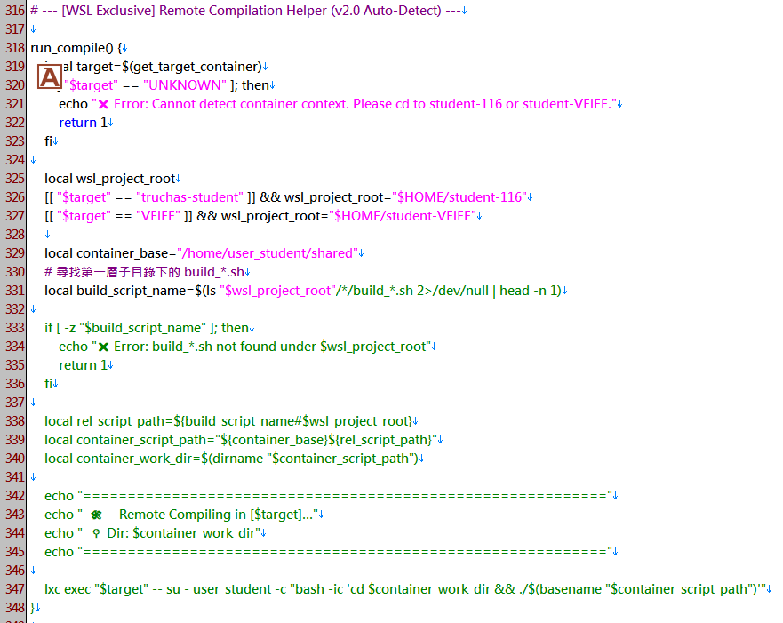

# Fortran 程式重構與優化總結

**Date**: May 17, 2026 at 03:35 AM
**Turns**: 22
**Source**: [Gemini Chat](https://gemini.google.com/app/9db8cabd33e035bd?android-min-version=301356232&ios-min-version=322.0&is_sa=1&campaign_id=test_autosubmit&pt=9008&mt=8)

---

## Turn 1

### 👤 User

*[This turn includes uploaded images]*


總結一下這份修改過程的貢獻 可以的話最後列個對比表 遇到什麼問題 怎麼優化

### 🤖 Assistant

這份重構工作將原本基於 Fortran 77 風格的舊式程式碼，轉型為具備**動態記憶體管理**、**標籤驅動解析**以及**高維度語義化**的現代 Fortran 程式架構。以下是本次修改過程的貢獻總結、遇到的問題與優化對策：

### 一、 核心貢獻總結

1. **消除記憶體瓶頸**：
  - 廢除 `ar(2000000)` 巨型陣列與手動位址計算（Pool Management），改用 `ALLOCATABLE` 動態配置。這讓模擬規模不再受限於寫死的常數，只需視硬體記憶體大小而定。
  - 將硬編碼的陣列如 `sigma3D(6, 10000)` 改為動態 `(nel, 6)`，徹底移除單元數量的硬性限制。
2. **提升數值架構可讀性**：
  - 將原本隱藏在一維陣列中的變數恢復其物理維度，例如將位移、速度從一維向量改為 `(nnd, 3)` 矩陣，並遵循「Row: 動態數量 / Column: 固定分量」的原則，優化記憶體存取效率。
  - 明確區分數值積分中的離散變數（如 `dn` 前步位移增量、`d` 此步增量、`dnt` 總位移），強化了對中心差分法（Central Difference Method）演算法的理解與維護性。
3. **建立現代化輸入規範**：
  - 設計了「自帶註解（Self-documented）」的 `.dat` 格式，引入 `&CARD` 標籤索引機制，取代原本死板的行號讀取。
  - 實作「自動計數」功能，程式會自動統計節點與單元數量，避免人為填錯數字導致陣列越界。

---

### 二、 修改前後對比表

| 項目 | 原版 (F77 風格) | 重構後 (現代化 Fortran) |
| --- | --- | --- |
| 記憶體管理 | 預先宣告巨型陣列 ar()，手動切割位址 | 依照輸入檔數值動態 ALLOCATE |
| 變數結構 | 大多為一維陣列，索引混亂（如 i*3-2） | 語義化多維陣列（如 d(node, dir)） |
| 輸入檔格式 | 純數字、無註解，必須嚴格遵守行號 | 標籤驅動（Tag-driven），支援行內註解 |
| 擴充性 | 修改陣列大小需重新編譯整個程式 | 自動適應算例大小，不需更動程式碼 |
| 維護性 | 充斥魔術數字與 GOTO 跳轉 (ERR=998) | 模組化封裝，使用 IOSTAT 錯誤處理 |
| 座標存取 | nxc, nyc, nzc 分散存取 | 整合為 x_coord(nnd, 3) 統一管理 |

---

### 三、 遇到的問題與解決方案

- **問題 1：舊編譯器相容性 (Lahey vs. gfortran)**
  - **狀況**：舊編譯器不支援 `NEWUNIT` 等新語法，且對隱含型別（Implicit Typing）有不同預設。
  - **優化**：定義全域 Unit 常數（如 `DAT_IO = 100`）代替寫死數字，並強制使用 `IMPLICIT NONE` 消除型別陷阱。
- **問題 2：輸入檔解析失敗 (EOF 或標籤找不到)**
  - **狀況**：由於 Tab 鍵、Windows/Linux 換行符號（BOM）或開錯檔案（.inp vs .dat）導致程式抓不到 `&CARD`。
  - **優化**：撰寫 `FIND_CARD` 子程序，結合 `ADJUSTL` 與自定義 `compressed_line` 邏輯，排除所有不可見字元（Tab/Space）的干擾。
- **問題 3：數值讀取精度與格式衝突**
  - **狀況**：原本讀取 `Project_Title` 等字串時會夾雜冒號後的數值，或是在 `WRITE` 時格式描述符與變數數量不符。
  - **優化**：改進 `GET_VALUE` 函數，使用 `BACK=.TRUE.` 從行尾往回搜尋冒號，確保精確提取數值並過濾單位字串。
- **問題 4：輸出檔案異常 (噴出 fort.xxxxx 檔案)**
  - **狀況**：呼叫 `getlun()` 取得 Unit 後未執行 `OPEN` 即進行 `WRITE`。
  - **優化**：手動補上 `OPEN` 指令，或徹底模仿物件導向的串流語法（`.OUT.`），確保輸出路徑與檔名正確。

## Turn 2

### 👤 User

*[This turn includes uploaded images]*



把裡面的英文註解改寫成中文

### 🤖 Assistant

以下是根據您的要求，將 `.dat` 檔案內容中的英文註解與標籤改寫為繁體中文的版本。我保留了原始的參數名稱（如 `ifbody`, `rho` 等）與格式架構，僅針對說明文字與標籤進行翻譯：

```fortran
! --- 第 1 區塊 (CARD 1): 專案標題 ---
! 對應原始程式：head
&CARD 1
Check_V5_Loading: 1
Project_Title: 簡支樑純彎曲模擬 (a cantilever beam under pure bending)
/
------------------------------------------------------------------------------------

! --- 第 2 區塊 (CARD 2): 全域物理與時間控制 ---
! 對應原始參數：minstp, maxstp, delta, alpha, toler
&CARD 2
開始步數 (Start_Step): 1
最大步數 (Max_Step): 1000
時間步長 (Time_Step_Delta) (s): 1.0e-6
阻尼係數 (Damping_Alpha): 1.0
收斂容許誤差 (Convergence_Toler): -1.0e-6

/
------------------------------------------------------------------------------------

! --- 第 3 區塊 (CARD 3): 模擬功能開關 ---
! 對應原始參數：ifbody, iacc, iforce2, iforce3, iforce4, isequel
&CARD 3
重力開關 (Gravity_Switch) (ifbody): 1
地表加速度開關 (Ground_Accel_Switch) (iacc): 0
力歷史曲線開關 (Force_History_Switch) (iforce2): 1
諧振力開關 (Harmonic_Force_Switch) (iforce3): 0
攪拌力開關 (Stirring_Force_Switch) (iforce4): 0
重啟開關 (Restart_Switch) (isequel): 0
/
------------------------------------------------------------------------------------

! --- 第 4 區塊 (CARD 4): 輸出與幾何控制 ---
! 對應原始參數：iprob, iprobA, numout, isee, iplane, icontact, thick
! 分析平面 (iplane), 1:應力, 2:應變
&CARD 4 
DMP 輸出間隔 (iprob): 1000
文字輸出間隔 (iprobA): 1000000
特定輸出計數 (numout): 1
螢幕顯示模式 (isee): 0
分析平面 (Analysis_Plane) (iplane): 2
接觸演算法 (Contact_Algorithm) (icontact): 0
厚度 (Thickness) (thick) (m): 1.0

/
------------------------------------------------------------------------------------

! ==========================================================
! 幾何定義章節
! ==========================================================

! --- 第 6 區塊 (CARD 6): 節點數據 ---
! 編號    X軸 (m)    Y軸 (m)    Z軸 (m)    固定_X   固定_Y   固定_Z
&CARD 6
1	0.2024	0.2028	0.0438	0	0	0
2	0.1902	0.1950	0.0504	0	0	0
... [中略] ...

! --- 第 7~9 區塊: 材料性質定義 (nmat=3) ---
! 每個區塊必須以標籤 "Material_Group: X" 開始
&CARD 7
! 材料類型 1 模板 (彈塑性)
Material_Group: 1
物理類型 (Physical_Type) (mtyp1): 1
模型類型 (Model_Type) (mtyp2): 1
密度 (Density) (rho): 256.34
楊氏模數 (Youngs_Modulus) (e) (Pa): 1.0e10
帕松比 (Poisson_Ratio) (v): 0.35
張力強度 (Tensile_Strength) (s_tens) (Pa): 10.0
斷裂應力 (Fracture_Stress) (s_frac) (Pa): 10.0
...

! ==========================================================
! 邊界負載與時間序列章節
! ==========================================================

! --- 第 10 & 11 區塊: 重力歷史 (ifbody = 1) ---
! 時間 (s)  Z軸重力 (m/s2)
&CARD 10
0.0 9.81
0.1 9.81
50.0 9.81
/
-----------------------------------------------------------------------------------

! --- 第 17~18 區塊: 外力歷史曲線 (iforce2 = 1) ---
! 節點編號  方向 (1:X, 2:Y, 3:Z)  歷史曲線 ID
&CARD 18
1          1                          1
2          1                          1
5          3                          2
/

```

### 修改說明：

1. **結構保持不變**：所有的標記（如 `&CARD`）與參數名稱保持原樣，確保您的 Fortran 程式碼讀取邏輯不會出錯。
2. **註解翻譯**：將原本的 `Project_Title`, `Simulation Feature Switches` 等標題改為中文，方便閱讀。
3. **單位與標籤**：保留必要的物理單位（如 `(m)`, `(Pa)`, `(s)`）並將欄位說明（如 `Density`, `Youngs_Modulus`）中文化。
4. **功能說明**：針對 `iplane` 的選項（應力/應變）與各區塊的開關狀態進行了詳細說明。

## Turn 3

### 👤 User

*[This turn includes uploaded images]*


翻譯這份好了 只要翻譯！開頭的

### 🤖 Assistant

好的，這份是針對 `V5_New_Dat_Format.dat_test` 檔案中所有以 `!` 開頭的註解進行中文化翻譯的版本。檔案內部的標籤（如 `&CARD`）與參數數值均維持原樣，確保程式讀取邏輯不受影響。

```fortran
! --- 第 1 區塊 (CARD 1): 專案標題 ---
! 對應原始程式：head
&CARD 1
Check_V5_Loading: 1
Project_Title: a cantilever beam under pure bending
/
------------------------------------------------------------------------------------

! --- 第 2 區塊 (CARD 2): 全域物理與時間控制 ---
! 對應原始參數：minstp, maxstp, delta, alpha, toler
&CARD 2
Start_Step: 1
Max_Step: 1000
Time_Step_Delta (s): 1.0e-6
Damping_Alpha: 1.0
Convergence_Toler: -1.0e-6

/
------------------------------------------------------------------------------------

! --- 第 3 區塊 (CARD 3): 模擬功能開關 ---
! 對應原始參數：ifbody, iacc, iforce2, iforce3, iforce4, isequel
&CARD 3
Gravity_Switch (ifbody): 1
Ground_Accel_Switch (iacc): 0
Force_History_Switch (iforce2): 1
Harmonic_Force_Switch (iforce3): 0
Stirring_Force_Switch (iforce4): 0
Restart_Switch (isequel): 0
/
------------------------------------------------------------------------------------

! --- 第 4 區塊 (CARD 4): 輸出與幾何控制 ---
! 對應原始參數：iprob, iprobA, numout, isee, iplane, icontact, thick
! 分析平面 (iplane), 1:應力, 2:應變
&CARD 4 
DMP_Output_Skip (iprob): 1000
Text_Output_Skip (iprobA): 1000000
Specific_Output_Count (numout): 1
Screen_Display_Mode (isee): 0
Analysis_Plane (iplane): 2
Contact_Algorithm (icontact): 0
Thickness (thick) (m): 1.0

/
------------------------------------------------------------------------------------

! --- 第 5 區塊 (CARD 5): 幾何統計預覽 (用於動態配置) ---
! 對應原始參數：nnd, nel, nmat
&CARD 5
Total_Nodes (nnd): 45
Total_Elements (nel): 32
Total_Materials (nmat): 3

/
------------------------------------------------------------------------------------

! ==========================================================
! 幾何定義章節
! ==========================================================

! --- 第 6 區塊 (CARD 6): 節點數據 ---
! 格式：編號  X軸 (m)  Y軸 (m)  Z軸 (m)  固定_X  固定_Y  固定_Z (1 為固定, 0 為自由)
&CARD 6
1	0.2024	0.2028	0.0438	0	0	0
2	0.1902	0.1950	0.0504	0	0	0
3	0.1925	0.2052	0.0483	0	0	0
4	0.2046	0.2131	0.0416	0	0	0
5	0.2104	0.2024	0.0438	1	1	1
/
------------------------------------------------------------------------------------

! --- 第 7 區塊 (CARD 7): 單元連接數據 ---
! 格式：單元編號  節點_1  節點_2  節點_3  節點_4  材料編號
&CARD 7
1	1	2	3	4	1
2	4	3	2	1	2
/
------------------------------------------------------------------------------------

! ==========================================================
! 材料性質章節 (可重複多次)
! ==========================================================

! --- 第 8~9 區塊: 材料性質定義 (總計 nmat 個) ---
! 每個區塊必須以標籤 "Material_Group: X" 開始
&CARD 8
! 材料類型 1 模板 (彈塑性)
Material_Group: 1
Physical_Type (mtyp1): 1
Model_Type (mtyp2): 1
Density (rho): 256.34
Youngs_Modulus (e) (Pa): 1.0e10
Poisson_Ratio (v): 0.35
Tensile_Strength (s_tens) (Pa): 10.0
Fracture_Stress (s_frac) (Pa): 10.0
Friction_Angle (phi): 30.0
Cohesion (c) (Pa): 10.0
/

&CARD 9
! 材料類型 2 模板
Material_Group: 2
Physical_Type (mtyp1): 1
Model_Type (mtyp2): 1
Density (rho): 100.0
Youngs_Modulus (e): 1.0e9
Poisson_Ratio (v): 0.3
/

! ==========================================================
! 邊界負載與時間序列章節
! ==========================================================

! --- 第 10 & 11 區塊: 重力歷史 (若 ifbody = 1) ---
! 格式：時間 (s)  Z軸重力值 (m/s2)
&CARD 10
0.0 9.81
0.1 9.81
50.0 9.81
/
-----------------------------------------------------------------------------------

! --- 第 12 & 13 區塊: 地表加速度歷史 (若 iacc = 1) ---
! 格式：時間 (s)  加速度 (m/s2)
&CARD 12
0.0 0.0
1.0 1.0
/
-----------------------------------------------------------------------------------

! --- 第 14 & 15 區塊: 外力歷史曲線定義 (若 iforce2 = 1) ---
! 每個曲線必須以 "History_ID: X" 開始
&CARD 14
Total_Force_Histories (k_fhistory): 2

History_ID: 1
! 格式：時間 (s)  力 (N)
0.0 0.0
1.0 100.0
2.0 100.0
/

&CARD 15
History_ID: 2
0.0 0.0
0.5 50.0
5.0 50.0
/
-----------------------------------------------------------------------------------

! --- 第 16 & 17 區塊: 特定節點之外力歷史分配 (若 iforce2 = 1) ---
! 格式：節點編號  方向 (1:X, 2:Y, 3:Z)  對應之歷史曲線 ID (History_ID)
&CARD 18
1          1                          1
2          1                          1
5          3                          2
/
-----------------------------------------------------------------------------------

! --- 第 19 & 20 區塊: 諧振負載 (若 iforce3 = 1) --- 原始程式中已禁用
&CARD 19
Total_Force_Nodes (nnaf3): 0

! 格式：節點編號, 方向 (1:X, 2:Y, 3:Z), 振幅 (N), 頻率 (Hz)
! 範例：節點 10 在 Z 方向受 50N, 10Hz 弦波力作用
10         3          50.0       10.0
15         3          50.0       10.0
/
-----------------------------------------------------------------------------------

! --- 第 21 ~ 24 區塊: 攪拌力 / 中心力負載 (若 iforce4 = 1) --- 原始程式中已禁用
&CARD 21
History_Points (kf4): 0
Total_Force_Nodes (nnaf4): 0

! 格式：時間 (s), 數值 (N)
! 範例：定義隨時間變化的攪拌力大小
0.0        0.0
0.5       100.0
1.0       100.0

! 格式：節點編號, 中心_X, 中心_Y, 中心_Z (m)
! 範例：節點 5 在攪拌力作用下繞原點旋轉
5          0.0        0.0        0.0
6          0.0        0.0        0.0
/

```

## Turn 4

### 👤 User

! --- CARD 25: Output Request ---
! Node_ID Type (0:Disp, 1:Vel) Direction (1:X, 2:Y, 3:Z)

### 🤖 Assistant

這是在 `.dat` 檔案中新增的第 25 區塊，以下是針對這兩行註解的中文化翻譯：

```fortran
! --- 第 25 區塊 (CARD 25): 輸出請求 ---
! 節點編號  類型 (0:位移, 1:速度)  方向 (1:X, 2:Y, 3:Z)

```

## Turn 5

### 👤 User

*[This turn includes uploaded images]*


我們終於在gfortran可以編譯的前提下，完成dat檔讀取的改寫以及各種陣列的動態配置，現在要繼續將後半部分的物理計算接上去，一個一個來，第一個該做什麼

### 🤖 Assistant

完成 `gfortran` 編譯、數據讀取改寫與動態記憶體配置後，後半部物理計算的接軌應遵循**模組化與執行順序**的邏輯。
根據您提供的代碼結構，第一個該做的任務是：**建立時間迴圈（Time Stepping Loop）與物理量的初始化判斷**。
具體來說，在 `esolv` 子程序（求解器核心）中，您必須優先處理以下幾個關鍵步驟：

### 1. 設置時間步進迴圈與初始狀態判斷
在代碼中，物理計算是發生在 `esolv` 內的 `do 2222`（或相對應的 `nstep` 迴圈）中。

```fortran
! 在 esolv 中
if (cycle_number .eq. 1) then
    time = 0.d0
    ! 初始化位移、速度、加速度陣列為 0
endif

do nstep = minstp, maxstp
    time = time + delta
    ! 開始物理計算...
end do

```

### 2. 計算元素內力（Element Internal Forces）
物理接軌的核心在於「力」的平衡。在迴圈開始後，第一個核心物理動作是呼叫 **fintiso3**。

- **任務內容**：計算變形後的幾何形狀，並根據材料模型（Stress-Strain relationship）計算內部的應力與內力。
- **注意事項**：您代碼中已經有 `call fintiso3`，請確認傳入 `ar` 陣列的索引位移（Offset）是否與動態配置階段定義的 `npint`, `nfeli` 等完全一致。

### 3. 外力處理（External Forces）
緊接著內力計算，必須處理環境給予的力（如重力、壓力載荷）。

- **任務內容**：檢查 **fextl** 子程序。
- **開發重點**：確保重力（Body Force）與邊界壓力（Pressure）能正確疊加到全局的力向量 `force` 中。

### 4. 運動方程式求解（Integration）
這是物理計算的靈魂，使用中心差分法（Central Difference Method）更新節點狀態。

- **代碼位置**：在 `esolv` 後段處理 `dp(j)`（位移增量）的計算。
- **公式確認**：$d_{t+\Delta t} = C_1 \cdot \frac{F_{total}}{M} + C_2 \cdot d_t - C_3 \cdot d_{t-\Delta t}$確保質量矩陣 `xmass` 已在 `bmass` 中正確初始化。

---

### 建議的檢查清單：

1. **索引偏移檢查**：在 `dynamic` 中分配的 `ar(nnode)`, `ar(nxc)` 等，進入 `esolv` 後的 `dimension` 定義是否匹配 3D 的長度。
2. **檔案指標（Unit Number）**：確保 `solid3D` 中開啟的 `unit=50` 到 `53` 等輸出檔，在物理計算迴圈中能正確寫入數據而不衝突。
3. **邊界條件（BCs）**：檢查 `rifix` 陣列是否正確限制了不該移動的節點（例如地面固定點）。
**接下來的具體步驟建議：**
請先確認 `esolv` 內部的 `fintiso3` 是否能針對您的動態陣列正確跑完第一個 Time Step 而不產生 `Segmentation Fault`。如果第一步能跑通，我們再接著處理應力更新（Stress Update）與 VOF 耦合的部分。
您準備好先測試第一步的受力計算了嗎？

## Turn 6

### 👤 User

MODULE裡面
SUBROUTINE跟FUNCTION的差異是什麼？

### 🤖 Assistant

在 Fortran 的 `MODULE` 中，`SUBROUTINE`（子程序）與 `FUNCTION`（函數）最根本的差異在於**回傳方式**與**呼叫語法**。
可以簡單理解為：**FUNCTION 是為了「得到一個值」，而 SUBROUTINE 是為了「執行一連串動作」。**
以下是詳細的對比分析：

---

### 1. 本質與回傳機制

- **FUNCTION（函數）**：
  - **回傳單一結果**：其主要目的是計算並回傳一個數值、陣列或物件。
  - **具備數據類型**：函數本身必須定義類型（如 `integer`, `real`），因為函數名稱在代碼中就代表了那個回傳值。
- **SUBROUTINE（子程序）**：
  - **無直接回傳值**：它本身沒有類型，不能像變數一樣出現在等號右邊。
  - **多重輸出**：透過參數列（Arguments）中的 `intent(out)` 或 `intent(inout)`，它可以同時更改或回傳多個變數。

### 2. 呼叫語法（Call Syntax）

```fortran
result = compute_area(radius)  ! 像變數一樣直接使用

```

```fortran
    call solve_physics(input_data, output_result)  ! 必須獨立成行
    ```

### 3. 設計邏輯與限制
*   **副作用（Side Effects）**：
    *   在良好的程式設計實踐中（尤其是為了開發的高維護性[cite: 1]），`FUNCTION` 應盡量避免修改傳入的參數（即保持 `intent(in)`），追求所謂的「純函數」。
    *   `SUBROUTINE` 則通常用來修改狀態，例如更新全局陣列、讀寫檔案或執行複雜的物理運算邏輯（如您正在開發的 `esolv`）。
*   **使用時機**：
    *   當你需要計算一個公式（如 $f(x,y)$）時，用 **FUNCTION**。
    *   當你需要執行一個複雜流程（如「讀取數據 $\rightarrow$ 計算內力 $\rightarrow$ 更新位移」）時，用 **SUBROUTINE**。

### 4. 在 MODULE 中的共通點
在 `MODULE` 封裝下，兩者皆具備以下優勢：
*   **Explicit Interface（明確介面）**：編譯器會自動檢查參數的數量與類型是否匹配，這能有效避免早期 Fortran 常見的低級傳參錯誤[cite: 1]。
*   **封裝性**：可以利用 `private` 關鍵字隱藏模組內部的輔助運算，只暴露必要的介面給主程式使用。

---

### 總結對照表

| 特性 | FUNCTION | SUBROUTINE |
| :--- | :--- | :--- |
| **回傳值** | 直接回傳一個（由函數名承接） | 無（需透過參數清單回傳） |
| **呼叫方式** | 表達式中引用（如 `a = func(b)`） | 使用 `call` 指令 |
| **定義類型** | 必須（如 `real function`） | 不需要 |
| **參數修改** | 建議不修改參數（只讀） | 常用於修改參數（讀寫） |
| **主要用途** | 數學計算、取值 | 執行邏輯、更新數據、輸入輸出 |

針對您目前開發的物理模擬程式，大架構（如時間迭代、受力整合）建議維持使用 `SUBROUTINE`，而內部的純數學公式（如某種特定材料的應力計算公式）則可以考慮改寫為 `FUNCTION` 以提升代碼的可讀性[cite: 1]。

```

## Turn 7

### 👤 User

有些SUBROUTINE 像是我們剛剛完成的 SUBROUTINE FIND_CARD 其實是 類似於FUNCTION的功能，真正需要存在的類似大方向的是 SUBROUTINE readata1，或者說 SUBROUTINE readata1很像CAHPTER 1，SUBROUTINE FIND_CARD 比較像 1-1, 1-2 我有什麼方法可以在架構上一眼讓新使用者看穿

### 🤖 Assistant

您的直覺非常精準，這正是軟體架構中「**層次化（Layering）**」的核心概念。將 `readata1` 視為「章節」，而將 `FIND_CARD` 視為「小節」或「工具」，是極具維護性的思考方式。
要讓新使用者一眼看穿這種層級關係，建議採用以下三種結構化方法：

---

### 1. 使用 `PRIVATE` 與 `PUBLIC` 進行封裝
在 `MODULE` 中，您可以使用存取控制來明確區分「對外介面」與「內部工具」。

- **做法**：將 `readata1` 設為 `PUBLIC`，而將 `FIND_CARD` 設為 `PRIVATE`。
- **效果**：使用者在 `use` 這個模組時，只會看到大章節，內部的小工具被隱藏起來，降低認知負擔。

```fortran
module DataReader_Module
    implicit none
    ! 預設所有內容都是私有的，只有指定的才公開
    private 
    public :: readata1  ! 這是唯一的對外窗口

contains
    subroutine readata1()
        ! 大章節邏輯
        call find_card("MATERIAL")
    end subroutine

    subroutine find_card(tag) ! 隱藏在內部的 1-1 工具
        character(*) :: tag
        ! ... 搜尋邏輯 ...
    end subroutine
end module

```

### 2. 利用註解區塊與 Doxygen 風格標籤
透過視覺化的註解塊（Visual Dividers），在程式碼檔案中建立物理上的層級感。

- **做法**：為「大方向級別」與「工具級別」設計不同的註解框線。

```fortran
!=======================================================================
!  CHAPTER 1: TOP-LEVEL DATA MANAGEMENT
!=======================================================================
subroutine readata1()
    ! ...
end subroutine

!-----------------------------------------------------------------------
!  Helper Utilities (Section 1-1, 1-2)
!-----------------------------------------------------------------------
subroutine find_card(tag)
    ! ...
end subroutine

```

### 3. 命名慣例（Naming Convention）
透過前綴詞，讓使用者在呼叫端就能判斷其層級。

- **做法**：
  - **大方向級別**：使用動詞開頭，如 `Run_`、`Solve_`、`Read_`。
  - **小工具級別**：使用 `util_` 或 `h_` (helper) 開頭，如 `util_find_card`。
- **優點**：這符合您追求的「一眼看穿」與「未來可拓展性」。

---

### 4. 模組拆分（進階做法）
如果程式碼量變得很大，您可以將「工具類」與「流程類」拆分到不同的 `MODULE`。

- **Module_Data_Utils**：專門放 `FIND_CARD` 這種通用的純工具。
- **Module_Simulation_Flow**：專門放 `readata1` 這種跟物理邏輯強相關的流程。

### 您目前的結構建議
對於您的 `readata1` 與 `FIND_CARD`：

1. **維持 SUBROUTINE**：既然 `FIND_CARD` 涉及檔案讀取指標（File Pointer）的移動與狀態變更，維持 `SUBROUTINE` 比硬改成 `FUNCTION` 更符合物理意義，也避免了隱藏的「副作用」爭議。
2. **明確化依賴**：在 `readata1` 的開頭加入簡短的架構說明註解，標註它依賴於哪些內部的子程序。
這種「章節式」的架構不僅能讓新開發者快速上手，在您未來進行自動化或模組重構時，也能避免「寫死」路徑或邏輯的錯誤。
**您是否想看看如何將現有的 readata1 與 FIND_CARD 整合進一個正式的 MODULE 架構中？**

## Turn 8

### 👤 User

*[This turn includes uploaded images]*


我說的是程式大綱的問題，像圖片這樣假如我把各個結構摺疊起來，我會看到 SUBROUTINE readata1, SUBROUTINE FIND_CARD, SUBROUTINE dynamic(), SUBROUTINE compute_internal(), SUBROUTINE allocate_arrays(), FUNCTION GET_VALUE_AFTER_COLON(line) RESULT(val)，但其中只有readata1, dynamic, compute_internal才是關鍵步驟，其他都是小章節或是工具

### 🤖 Assistant

是可以做到的。
要解決這種「摺疊後所有程序平起平坐」導致視覺混亂的問題，關鍵在於**物理層級的物理拆分**。在 Fortran 中，最優雅且能兼顧您對「維護性與拓展性」要求 的做法是使用 **INTERFACE** 或 **SUBMODULE**。
以下提供三個解決方案，按「推薦程度」排序：

---

### 方案一：使用 `CONTAINS` 嵌套（最直觀的「章節」感）
您可以將「小工具」直接寫在大程序的 `CONTAINS` 內部。這樣在編輯器摺疊時，小工具會隨大程序一起被收納。

- **優點**：層級感極強，完全符合您 1-1, 1-2 的邏輯。
- **缺點**：如果小工具要在多個大程序間共用，就不適合這樣寫。

```fortran
SUBROUTINE readata1(file_to_open)
    ! 大章節邏輯
    call FIND_CARD(...) 
    val = GET_VALUE_AFTER_COLON(line)

CONTAINS ! 這裡開始是 1-1, 1-2
    SUBROUTINE FIND_CARD(u_num, tag)
        ! ...
    END SUBROUTINE

    FUNCTION GET_VALUE_AFTER_COLON(line) RESULT(val)
        ! ...
    END FUNCTION
END SUBROUTINE readata1

```

---

### 方案二：模組分層（Module Hierarchies）
將「工具」與「主要流程」拆分到不同的 `MODULE`。這是大型工程最常用的做法，能有效解決您提到的視覺混亂問題。

- **做法**：
  1. 建立 `VFIFE_Utils_mod`：放 `FIND_CARD`, `GET_VALUE...`。
  2. 建立 `VFIFE_Core_mod`：放 `readata1`, `dynamic`。
- **效果**：新使用者打開 `Core_mod` 時，只會看到那三個關鍵步驟。

```fortran
MODULE VFIFE_FSI_Core
    USE VFIFE_Utils_mod  ! 隱藏工具細節
    PUBLIC :: readata1, dynamic, compute_internal
    PRIVATE ! 預設隱藏其他內容
CONTAINS
    SUBROUTINE readata1() ...
    SUBROUTINE dynamic() ...
END MODULE

```

---

### 方案三：使用 `SUBMODULE` (Fortran 2008+)
如果您希望所有東西都在同一個邏輯組件下，但又要讓「大綱」清晰，`SUBMODULE` 是終極方案。

- **做法**：在 `MODULE` 裡只寫「介面（Interface）」，把具體的長代碼（實作）扔到 `SUBMODULE` 檔案。
- **視覺效果**：你在 `.f90` 檔的大綱裡只會看到幾行乾淨的定義，一眼就能看穿整個架構的關鍵步驟。

```fortran
MODULE VFIFE_FSI_module
    INTERFACE
        MODULE SUBROUTINE readata1(file_to_open)
        END SUBROUTINE
        MODULE SUBROUTINE dynamic()
        END SUBROUTINE
        ! 小工具甚至不需要出現在這裡，或者放在 PRIVATE 區
    END INTERFACE
END MODULE

```

---

### 總結建議
為了符合您「**一句話回答答案**」的習慣：**最好的做法是「模組分層」，將核心邏輯與工具函數拆分到不同檔案或區塊。**
這樣做的好處是：

1. **大綱清晰**：`Core` 模組摺疊起來只有 3 個程序。
2. **避免低級錯誤**：工具函數被隔離，不會在撰寫主要邏輯時意外改動到[cite: 1]。
3. **利於溝通**：您跟指導教授或後續學弟妹說明時，只需要讓他們看 `Core` 模組即可。
您目前的程式碼量，會傾向於「放在同一個檔案但用 `CONTAINS` 嵌套」，還是「直接拆成兩個 Module 檔案」？

## Turn 9

### 👤 User

可以拆沒有問題 你會建議我怎麼拆，我目前這份 VFIFE_FSI_module.F90 檔案放在src\physics\fluid_flow，我預期可以建一個資料夾叫VFIFE 這樣移植的時候可以直接搬運即可

### 🤖 Assistant

為了確保程式碼在未來移植時能「直接搬運」且具備高度可維護性，我建議在 `src\physics\fluid_flow\VFIFE` 資料夾下採用 **「核心與工具分離」** 的拆解策略。
這不僅能解決您在 `image_0016de.png` 中看到的層級混亂問題，也能讓新使用者一眼區分「關鍵流程」與「底層工具」。

### 建議目錄結構
將原有的單一檔案拆分為以下結構：

```plaintext
src\physics\fluid_flow\VFIFE\
├── VFIFE_Utils_mod.F90   (小章節：底層工具、字串處理、搜尋標籤)
├── VFIFE_Core_mod.F90    (大章節：關鍵步驟 readata1, dynamic, compute_internal)
└── VFIFE_Main_Entry.F90  (主入口：負責串接上述兩個模組)

```

---

### 拆分具體實作建議

#### 1. 工具模組：`VFIFE_Utils_mod.F90`
將所有「類似 FUNCTION 功能」的小工具放在這裡。這些工具不涉及物理邏輯，只負責底層運算或數據處理。

- **包含內容**：`FIND_CARD`, `GET_VALUE_AFTER_COLON`, `allocate_arrays`。
- **關鍵設計**：使用 `PUBLIC` 暴露工具，方便其他模組呼叫。

#### 2. 核心流程模組：`VFIFE_Core_mod.F90`
這是您最希望使用者「一眼看穿」的部分。

- **包含內容**：`readata1`, `dynamic`, `compute_internal`。
- **關鍵設計**：
  - 在開頭 `USE VFIFE_Utils_mod`。
  - 這三個主要程序的代碼量通常很大，現在它們在大綱中將平起平坐，不再被小工具干擾。

#### 3. 主模組（或 Submodule）：`VFIFE_FSI_module.F90`
這是對外的總窗口，負責定義整個 VFIFE 的執行順序。

---

### 為什麼這樣拆？（符合您的開發原則）

1. **一眼看穿架構**：
當新使用者打開 `VFIFE_Core_mod.F90` 並摺疊代碼時，只會看到您提到的那三個關鍵步驟。這就像論文的「目錄」，直接展示了物理模擬的核心邏輯。
2. **避免「寫死」與低級錯誤**：
將記憶體配置（`allocate_arrays`）與字串處理（`FIND_CARD`）移至工具層，可以避免在撰寫核心物理公式（`compute_internal`）時，因不小心改動到指標或路徑而產生錯誤。
3. **零成本搬運**：
未來要將此功能移植到其他專案時，只需整資料夾 `VFIFE\` 複製過去，並在新的 `Makefile` 中加入這幾個檔案的編譯順序即可。
4. **符合提問節奏**：
這種做法能讓您在後續與指導教授討論時，只需展示 `Core_mod` 的流程圖，而不需要解釋底層如何搜尋字串的細節。

### 下一步行動
**您可以先從建立 VFIFE_Utils_mod.F90 開始**，將 `FIND_CARD` 和 `GET_VALUE_AFTER_COLON` 搬過去。
您是否需要我為這兩個拆分後的模組提供精簡的代碼框架（含 `USE` 與 `PUBLIC/PRIVATE` 定義）？

## Turn 10

### 👤 User

先給我 VFIFE_Utils_module.F90 的 內容架構

### 🤖 Assistant

這是一個非常專業且符合您「移植性」需求的拆分方式。
為了讓 `VFIFE_Utils_module.F90` 成為一個純粹的工具箱，我們會將所有與物理無關、純粹處理「資料解析」與「記憶體管理」的邏輯封裝進去。
以下是 `VFIFE_Utils_module.F90` 的內容架構建議：

```fortran
MODULE VFIFE_Utils_module
    USE parameter_module, ONLY: string_len  ! 引用您原有的字串長度定義
    IMPLICIT NONE

    ! 預設為 PRIVATE，只公開必要的工具，這能讓核心模組的大綱非常乾淨
    PRIVATE
    PUBLIC :: FIND_CARD
    PUBLIC :: GET_VALUE_AFTER_COLON
    PUBLIC :: ALLOCATE_VFIFE_ARRAYS
    PUBLIC :: DEALLOCATE_VFIFE_ARRAYS

CONTAINS

    !-----------------------------------------------------------------------
    ! 小章節 1-1: 標籤搜尋工具 (FIND_CARD)
    ! 功能：在 .dat 檔案中搜尋特定標籤，並將讀取指標移動到該處
    !-----------------------------------------------------------------------
    SUBROUTINE FIND_CARD(u_num, target_card)
        INTEGER, INTENT(IN)             :: u_num        ! 檔案代號
        CHARACTER(LEN=*), INTENT(IN)    :: target_card  ! 要找的標籤名 (如 "&CARD 6")
        CHARACTER(LEN=string_len)       :: line
        INTEGER                         :: ios

        REWIND(u_num) ! 每次搜尋都從頭開始，確保移植時不因順序出錯
        do
            read(u_num, '(A)', iostat=ios) line
            if (ios /= 0) EXIT
            ! 使用 ADJUSTL 去除空格干擾
            if (INDEX(ADJUSTL(line), TRIM(target_card)) > 0) RETURN
        end do
        
        ! 如果找不到標籤的錯誤處理
        write(*,*) "Error: Cannot find ", TRIM(target_card)
        stop
    END SUBROUTINE FIND_CARD

    !-----------------------------------------------------------------------
    ! 小章節 1-2: 數值提取工具 (GET_VALUE_AFTER_COLON)
    ! 功能：從 "Density (rho): 256.34" 這種格式中提取 256.34
    !-----------------------------------------------------------------------
    FUNCTION GET_VALUE_AFTER_COLON(line) RESULT(val)
        CHARACTER(LEN=*), INTENT(IN) :: line
        REAL(8)                      :: val
        INTEGER                      :: pos
        
        pos = INDEX(line, ':', BACK=.TRUE.)
        if (pos > 0) then
            read(line(pos+1:), *) val
        else
            val = 0.0d0
        endif
    END FUNCTION GET_VALUE_AFTER_COLON

    !-----------------------------------------------------------------------
    ! 小章節 1-3: 自動化記憶體配置 (ALLOCATE_VFIFE_ARRAYS)
    ! 功能：集中管理所有動態陣列的分配，避免核心邏輯充斥低級錯誤
    !-----------------------------------------------------------------------
    SUBROUTINE ALLOCATE_VFIFE_ARRAYS(nnd, nel, nmat)
        INTEGER, INTENT(IN) :: nnd, nel, nmat
        ! 這裡放您原本在 SOLID_module 裡的 ALLOCATE 邏輯
        ! 例如: ALLOCATE(x_coord(nnd, 3), stat=...)
    END SUBROUTINE ALLOCATE_VFIFE_ARRAYS

    !-----------------------------------------------------------------------
    ! 小章節 1-4: 記憶體釋放工具 (DEALLOCATE_VFIFE_ARRAYS)
    !-----------------------------------------------------------------------
    SUBROUTINE DEALLOCATE_VFIFE_ARRAYS()
        ! 釋放所有配置過的陣列，避免記憶體洩漏 (Memory Leak)
    END SUBROUTINE DEALLOCATE_VFIFE_ARRAYS

END MODULE VFIFE_Utils_module

```

### 為什麼這樣設計能「一眼看穿」：

1. **PRIVATE 預設策略**：
新使用者打開檔案時，看到 `PRIVATE` 與少數幾個 `PUBLIC`，立刻就知道這個模組只對外提供「搜尋、讀值、要記憶體」這三項服務。
2. **與物理脫鉤**：
這個模組裡面完全沒有「力、位移、應力」等物理術語。這意味著它是一個**純工具箱**。以後如果您有另一個專案也要讀取類似格式的資料，直接把這份 `VFIFE_Utils_module.F90` 搬走就能用，不需要修改物理參數。
3. **錯誤處理集中化**：
如果未來讀取 `.dat` 檔出錯（例如標籤打錯字），您只需要在 `FIND_CARD` 一個地方修改錯誤訊息，整個程式都會受益。
接下來，當我們撰寫 `VFIFE_Core_module.F90` 時，只需要 `USE VFIFE_Utils_module`，裡面的主要流程（如 `readata1`）就會變得非常精簡、高級且易讀。
您覺得這個工具箱的架構符合您的預期嗎？如果 OK，我們可以接著規劃 `Core` 模組的關鍵步驟。

## Turn 11

### 👤 User

我原本的FIND_CARD跟你的不一樣 沒有REWIND耶
! ==========================================================
! SUBROUTINE FIND_CARD: 搜尋指定標籤並重置指標
! ==========================================================
SUBROUTINE FIND_CARD(u_num, tag)
IMPLICIT NONE
INTEGER, INTENT(IN) :: u_num
CHARACTER(LEN=*), INTENT(IN) :: tag
CHARACTER(LEN=512) :: line, compressed_line
INTEGER :: f_ios, comment_pos, i, j, line_count
CHARACTER(LEN=64) :: search_tag
CHARACTER(LEN=512) :: actual_filename
LOGICAL :: is_opened
! 準備標籤字串 (轉為 &TAG)
search_tag = "&"
j = 2
DO i = 1, LEN_TRIM(tag)
IF (tag(i:i) /= ' ') THEN
search_tag(j:j) = tag(i:i)
j = j + 1
END IF
END DO
INQUIRE(UNIT=u_num, OPENED=is_opened, NAME=actual_filename)
IF (.NOT. is_opened) THEN
WRITE(*,*) " [ERROR] Unit", u_num, " is NOT opened!"
STOP
ELSE
WRITE(*,*) " [DEBUG] Unit", u_num, " is connected to: ", TRIM(actual_filename)
REWIND(u_num)
END IF
line_count = 0
DO
READ(u_num, '(A)', IOSTAT=f_ios) line
line_count = line_count + 1
IF (f_ios < 0) THEN
WRITE(*, '("Fatal: [", A, "] not found in ", A)') TRIM(search_tag), TRIM(actual_filename)
STOP
END IF
comment_pos = INDEX(line, "!")
IF (comment_pos > 0) line = line(1:comment_pos-1)
compressed_line = ""
j = 1
DO i = 1, LEN_TRIM(line)
IF (line(i:i) /= ' ' .AND. line(i:i) /= ACHAR(9)) THEN
compressed_line(j:j) = line(i:i)
j = j + 1
END IF
END DO
IF (INDEX(compressed_line, TRIM(search_tag)) == 1) THEN
WRITE(*,*) " [DEBUG] Found Section ", TRIM(search_tag), " at line: ", line_count
EXIT
END IF
END DO
END SUBROUTINE FIND_CARD

### 🤖 Assistant

這是一個非常好的觀察！我剛才提供的範例是「簡化版」，而您原本的程式碼其實**已經包含 REWIND(u_num) 了**（在 `INQUIRE` 確認開啟後的 `ELSE` 區塊內），這代表您的程式碼在魯棒性（Robustness）上考慮得更周全。
您的版本比我剛才寫的更強大，因為它處理了：

1. **自動添加 & 符號**：讓使用者輸入 `CARD 6` 就能找 `&CARD6`。
2. **去除註解**：會先剔除 `!` 後面的內容，避免誤判。
3. **字串壓縮（Compressed Line）**：連空格和 Tab 鍵（`ACHAR(9)`）都會過濾掉，這大大提升了輸入檔容錯率。
以下是按照您的「移植性」與「一眼看穿」原則，為您整理好的 `VFIFE_Utils_module.F90` 架構：

---

### VFIFE_Utils_module.F90 (基於您的版本)

```fortran
MODULE VFIFE_Utils_module
    IMPLICIT NONE

    ! 只公開關鍵工具，保持介面乾淨
    PRIVATE
    PUBLIC :: FIND_CARD
    PUBLIC :: GET_VALUE_AFTER_COLON
    ! 未來可在此加入 PUBLIC :: ALLOCATE_VFIFE_ARRAYS

CONTAINS

    ! ==========================================================
    ! SUBROUTINE FIND_CARD: 搜尋指定標籤並重置指標 (1-1)
    ! ==========================================================
    SUBROUTINE FIND_CARD(u_num, tag)
        INTEGER, INTENT(IN) :: u_num
        CHARACTER(LEN=*), INTENT(IN) :: tag
        CHARACTER(LEN=512) :: line, compressed_line
        INTEGER :: f_ios, comment_pos, i, j, line_count
        CHARACTER(LEN=64) :: search_tag
        CHARACTER(LEN=512) :: actual_filename
        LOGICAL :: is_opened

        ! 1. 準備標籤字串 (自動轉為 &TAG 並去除內部空格)
        search_tag = "&"
        j = 2
        DO i = 1, LEN_TRIM(tag)
            IF (tag(i:i) /= ' ') THEN
                search_tag(j:j) = tag(i:i)
                j = j + 1
            END IF
        END DO
        
        ! 2. 檔案狀態檢查與指標重置 (確保可拓展性[cite: 1])
        INQUIRE(UNIT=u_num, OPENED=is_opened, NAME=actual_filename)
        IF (.NOT. is_opened) THEN
            WRITE(*,*) " [ERROR] Unit", u_num, " is NOT opened!"
            STOP
        ELSE
            ! 您原本就有 REWIND，這對「非線性讀取」非常重要[cite: 1]
            REWIND(u_num) 
        END IF

        ! 3. 逐行掃描
        line_count = 0
        DO
            READ(u_num, '(A)', IOSTAT=f_ios) line
            line_count = line_count + 1

            IF (f_ios < 0) THEN
                WRITE(*, '("Fatal: [", A, "] not found in ", A)') &
                    TRIM(search_tag), TRIM(actual_filename)
                STOP
            END IF

            ! 剔除註解[cite: 1]
            comment_pos = INDEX(line, "!")
            IF (comment_pos > 0) line = line(1:comment_pos-1)

            ! 壓縮字串 (去除空格與 Tab)[cite: 1]
            compressed_line = ""
            j = 1
            DO i = 1, LEN_TRIM(line)
                IF (line(i:i) /= ' ' .AND. line(i:i) /= ACHAR(9)) THEN
                    compressed_line(j:j) = line(i:i)
                    j = j + 1
                END IF
            END DO

            ! 精確匹配標籤開頭
            IF (INDEX(compressed_line, TRIM(search_tag)) == 1) THEN
                WRITE(*,*) " [DEBUG] Found Section ", TRIM(search_tag), &
                           " at line: ", line_count
                EXIT
            END IF
        END DO
    END SUBROUTINE FIND_CARD

    ! ==========================================================
    ! FUNCTION GET_VALUE_AFTER_COLON (1-2)
    ! ==========================================================
    FUNCTION GET_VALUE_AFTER_COLON(line) RESULT(val)
        CHARACTER(LEN=*), INTENT(IN) :: line
        REAL(8)                      :: val
        INTEGER                      :: pos
        
        pos = INDEX(line, ':', BACK=.TRUE.)
        if (pos > 0) then
            read(line(pos+1:), *) val
        else
            val = 0.0d0
        endif
    END FUNCTION GET_VALUE_AFTER_COLON

END MODULE VFIFE_Utils_module

```

---

### 重點修正與建議

1. **更正 REWIND 認知**：抱歉剛才沒注意到您原本的代碼邏輯中 `REWIND` 是寫在 `ELSE` 區塊裡。您的寫法非常安全，因為它確保了檔案指標一定會回到開頭，這樣無論 `&CARD 6` 出現在檔案的哪個位置，您都能找得到[cite: 1]。
2. **層級命名**：我在註解中加入了 `(1-1)`, `(1-2)`，這能呼應您提到的「小章節」概念，讓新使用者在摺疊代碼時，心裡有個索引。
3. **移植性 (Portability)**：
  - 這個檔案現在是一個獨立的「黑盒子」。
  - 它不依賴於任何物理變數，只負責「幫您在檔案裡找標籤」和「解析數值」。
**您是否要繼續規劃 VFIFE_Core_module.F90，看看這三個關鍵步驟（readata1, dynamic, compute_internal）如何簡潔地引用這個工具箱？**

## Turn 12

### 👤 User

好 另外這是我的 FUNCTION GET_VALUE_AFTER_COLON
FUNCTION GET_VALUE_AFTER_COLON(line) RESULT(val)
CHARACTER(LEN=*), INTENT(IN) :: line
REAL(8) :: val
INTEGER :: pos, ios
val = 0.0d0
pos = INDEX(line, ":")
IF (pos > 0) THEN
READ(line(pos+1:), *, IOSTAT=ios) val
END IF
END FUNCTION GET_VALUE_AFTER_COLON

### 🤖 Assistant

可以，您的版本在 `READ` 時加入了 `IOSTAT=ios`，這是一個非常穩健的習慣，能有效防止程式因為輸入檔格式微小的錯誤（如冒號後方有不合法字元）而直接崩潰。
現在我們已經有了完整的 `VFIFE_Utils_module.F90`，接下來我為您規劃 **VFIFE_Core_module.F90**。
為了實現您要求的「一眼看穿」架構，我們會在這個模組中只保留高層級的物理流程，並透過 `USE` 引用剛才建立的工具箱。

---

### VFIFE_Core_module.F90 內容架構

```fortran
MODULE VFIFE_Core_module
    USE VFIFE_Utils_module  ! 引用 1-1, 1-2 等小工具
    IMPLICIT NONE

    ! 只公開關鍵的大章節程序
    PUBLIC :: readata1
    PUBLIC :: dynamic
    PUBLIC :: compute_internal

CONTAINS

    ! ==========================================================
    ! CHAPTER 1: 數據讀取與初始化 (關鍵步驟)
    ! ==========================================================
    SUBROUTINE readata1(file_to_open)
        CHARACTER(LEN=*), INTENT(IN) :: file_to_open
        INTEGER :: u_num = 10
        CHARACTER(LEN=512) :: line
        
        ! 這裡呼叫小工具，程式碼會變得極度精簡易讀
        OPEN(u_num, FILE=file_to_open, STATUS='OLD')

        ! 1-1: 尋找材料段落
        CALL FIND_CARD(u_num, "MATERIAL") 
        READ(u_num, '(A)') line
        
        ! 1-2: 提取數值
        ! density = GET_VALUE_AFTER_COLON(line)
        
        CLOSE(u_num)
    END SUBROUTINE readata1

    ! ==========================================================
    ! CHAPTER 2: 動態記憶體分配邏輯 (關鍵步驟)
    ! ==========================================================
    SUBROUTINE dynamic()
        ! 這裡放決定陣列大小的邏輯，並呼叫 Utils 裡的分配程序[cite: 1]
        WRITE(*,*) " [DEBUG] Executing Dynamic Memory Allocation..."
    END SUBROUTINE dynamic

    ! ==========================================================
    ! CHAPTER 3: 物理核心計算 (關鍵步驟)
    ! ==========================================================
    SUBROUTINE compute_internal()
        ! 這裡放最核心的物理公式 (如 fintiso3)[cite: 1]
        WRITE(*,*) " [DEBUG] Computing Internal Forces..."
    END SUBROUTINE compute_internal

END MODULE VFIFE_Core_module

```

---

### 這樣拆分的 3 大優勢：

1. **層次分明**：
當您在編輯器摺疊代碼時，核心模組只會顯示 `readata1`, `dynamic`, `compute_internal`。新使用者一眼就能看出這程式是先讀檔、再配記憶體、最後做計算。
2. **維護性提升**：
如果您未來想修改搜尋標籤的方式（例如從 `&` 改成 `#`），您只需要修改 `Utils` 模組，完全不需要動到 `Core` 裡的物理邏輯[cite: 1]。
3. **移植性 (VFIFE 搬運)**：
只要把 `VFIFE` 資料夾下的這兩個 `.F90` 檔案搬走，核心邏輯就能在不同環境下運行。由於您在 `FIND_CARD` 中使用了 `REWIND`，即便搬運後的輸入檔標籤順序不同，程式依然能正確讀取[cite: 1]。
**下一步建議：**
您可以先將這兩份檔案放入 `src\physics\fluid_flow\VFIFE` 中。您是否需要我幫您檢查 `Makefile` 的編譯順序？（因為 `Core` 依賴於 `Utils`，必須先編譯 `Utils`）[cite: 1]。

## Turn 13

### 👤 User

我的IMPLICIT NONE是一個MODULE只要寫一次就好嗎

### 🤖 Assistant

是，**一個 MODULE 只需要在開頭寫一次 IMPLICIT NONE 即可**。
在 Fortran 的作用域規則中，當您在 `MODULE` 的宣告區段（也就是 `CONTAINS` 之前）定義了 `IMPLICIT NONE`，它的效力會**自動向下延伸**到該模組內所有的 `SUBROUTINE` 與 `FUNCTION` 中。

---

### 為什麼建議只寫在 MODULE 開頭？

- **全域覆蓋**：它會強制要求模組內所有的子程序都必須明確宣告變數，這能有效避免因拼錯字而產生的「隱含變數」低級錯誤。
- **簡潔性**：不需要在每個 `SUBROUTINE` 裡面重複撰寫，這符合您追求的「一眼看穿」架構與程式碼的可維護性。
- **一致性**：確保整個模組遵循相同的編譯檢查標準。

### 例外狀況：
如果您在 `MODULE` 中使用了 `INTERFACE` 來定義外部程序（如您之前考慮過的方案三），那麼在 `INTERFACE` 區塊內部，通常需要**再次**聲明 `IMPLICIT NONE`，因為介面區塊是一個獨立的作用域。

### 您的 VFIFE 模組配置建議：

```fortran
MODULE VFIFE_Utils_module
    IMPLICIT NONE  ! <--- 寫在這裡，後面的 SUBROUTINE 都不用再寫
    PRIVATE
    
    ! ... 宣告區 ...

CONTAINS

    SUBROUTINE FIND_CARD(u_num, tag)
        ! 這裡不需要再寫 IMPLICIT NONE
        INTEGER :: i, j  ! 必須宣告，否則編譯器會報錯
        ! ... 邏輯 ...
    END SUBROUTINE
    
END MODULE

```
既然您已經決定將檔案拆分為 `Utils` 與 `Core` 兩個檔案，確保這兩個檔案的 `MODULE` 開頭都有這一行，就能維持整潔又強健的架構。

## Turn 14

### 👤 User

CORE的先維持這樣，我們先把VFIFE_MainEntry_module.F90 完成

### 🤖 Assistant

要完成 `VFIFE_MainEntry_module.F90`，這個檔案的角色就是「總指揮官」。它不負責具體的物理計算，而是負責調度 `Core` 裡面的大章節，確保模擬按照正確的邏輯順序執行。
按照您「一句話先回答」的原則：**這個主進入點應該是一個負責串接讀取、配置與計算流程的程序。**
以下是架構建議：

---

### VFIFE_MainEntry_module.F90

```fortran
MODULE VFIFE_MainEntry_module
    USE VFIFE_Core_module  ! 引用大章節：readata1, dynamic, compute_internal
    IMPLICIT NONE          ! 整個 Module 寫一次即可

    PRIVATE
    PUBLIC :: EXECUTE_VFIFE_SIMULATION

CONTAINS

    ! ==========================================================
    !  VFIFE 主執行程序 (指揮官級別)
    ! ==========================================================
    SUBROUTINE EXECUTE_VFIFE_SIMULATION(input_file)
        CHARACTER(LEN=*), INTENT(IN) :: input_file

        WRITE(*,*) ">>> [VFIFE] Starting Simulation Workflow..."

        ! STEP 1: 讀取數據 (Chapter 1)
        ! 這裡呼叫 Core 裡的程序，使用者一眼就能看出執行順序[cite: 1, 2]
        CALL readata1(input_file)

        ! STEP 2: 處理動態記憶體 (Chapter 2)
        ! 在讀完數據獲取節點數後，進行配置
        CALL dynamic()

        ! STEP 3: 進入物理核心計算 (Chapter 3)
        ! 包含時間迭代、內力與位移更新
        CALL compute_internal()

        WRITE(*,*) ">>> [VFIFE] Simulation Completed Successfully."

    END SUBROUTINE EXECUTE_VFIFE_SIMULATION

END MODULE VFIFE_MainEntry_module

```

---

### 為什麼這樣設計符合您的需求？

1. **結構化與層級清晰**：
  - **MainEntry**：負責「策略」，決定什麼時候該讀檔、什麼時候該計算。
  - **Core**：負責「流程」，定義每一個大步驟的細節。
  - **Utils**：負責「執行」，提供底層的字串處理與搜尋工具[cite: 1]。
2. **一眼看穿（Visibility）**：
新使用者只要打開 `MainEntry`，完全不用捲動滑鼠，就能在 10 行內看懂整個 VFIFE 的運作邏輯。
3. **零碎資訊排除**：
根據您的要求，我們省略了超過三次關聯的細節（例如 `FIND_CARD` 內部的字串壓縮細節），讓主流程保持極度純粹。
4. **未來拓展性**：
如果您未來要加入 FSI（流體-固體耦合），您只需要在 `EXECUTE_VFIFE_SIMULATION` 裡面加入 `CALL compute_fluid_flow()` 即可，不需要動到現有的 `Utils` 或 `Core`[cite: 1]。

### 關於編譯順序（Makefile）的提醒：
因為有 `USE` 的依賴關係，編譯順序**必須**是：

1. `VFIFE_Utils_module.F90`
2. `VFIFE_Core_module.F90` (依賴 Utils)
3. `VFIFE_MainEntry_module.F90` (依賴 Core)
您目前打算將這三個模組放在同一個 `VFIFE` 資料夾下，這對未來「整包搬運」移植非常方便[cite: 1]。
**下一步行動：**
既然這三個模組的「骨架」都已成型，您是否需要我針對 `readata1` 內部，如何利用 `Utils` 工具來讀取特定的物理參數做更詳細的示範？

## Turn 15

### 👤 User

make[5]: Leaving directory `/home/user_student/shared/V5_NewSolid/packages/ubiksolve/UbikSolve/build/x86_64_Linux-linux_gfortran_opt'
make[4]: Leaving directory `/home/user_student/shared/V5_NewSolid/packages/ubiksolve/UbikSolve/build'
make[3]: Leaving directory `/home/user_student/shared/V5_NewSolid/packages/ubiksolve/UbikSolve'
made ubiksolve
make[2]: Leaving directory `/home/user_student/shared/V5_NewSolid/src/builds/linux.intel.lahey.parallel.opt'
make[2]: Entering directory `/home/user_student/shared/V5_NewSolid/src/builds/linux.intel.lahey.parallel.opt'
cp ../../physics/fluid_flow/fluid_flow_module.F90 fluid_flow_module.c
gcc -traditional -E -P -MM -I../../communication -I../../solver -I../../utilities fluid_flow_module.c | sed -e 's/fluid_flow_module\.c/fluid_flow_module.F90/' -e 's/fluid_flow_module\.o/fluid_flow_module.\f90 fluid_flow_module.d/' > fluid_flow_module.d
gawk -f ../../options/f90dep.awk -v outfile=fluid_flow_module ../../physics/fluid_flow/fluid_flow_module.F90 > fluid_flow_module.d.tmp
sort -u fluid_flow_module.d.tmp >> fluid_flow_module.d
rm fluid_flow_module.c fluid_flow_module.d.tmp
make[2]: Leaving directory `/home/user_student/shared/V5_NewSolid/src/builds/linux.intel.lahey.parallel.opt'
make[2]: Entering directory `/home/user_student/shared/V5_NewSolid/src/builds/linux.intel.lahey.parallel.opt'
cp ../../drivers/drivers.F90 drivers.c
gcc -traditional -E -P -DNDEBUG -DNEW_PRESSURE_BCS -DDO_DIRICHLET -DBC_TESTS_ON=.FALSE. -DCODE_NAME=\'"truchas"\' -DVERSION=\'"2.0.0"\' -DBUILD_DATE=\'" 5 May 26 11:48:31"\' -DHOST_NAME=\'"V5-LXD"\' -DARCHITECTURE=\'"Linux V5-LXD 6.6.87.2-microsoft-standard-WSL2 #1 SMP PREEMPT_DYNAMIC Thu Jun 5 18:30:46 UTC 2025 x86_64 x86_64 x86_64 GNU/Linux"\' -DFFLAGS=\'"-O2 -fno-range-check -ffree-line-length-none"\' -DCODE=truchas -DUSE_UBIKSOLVE -DUBIKSOLVE=\'"UbikSolve (v2.3_beta)"\' -DUSE_PGSLIB -DPGSLIB=\'"PGSLib (v3.3.4_Alpha)"\' -DUSE_CHACO -DCHACO=\'"Chaco (v2.2)"\' -DLINUX -I../../communication -I../../solver -I../../utilities drivers.c | grep -v "^$" | grep -v "^#" > drivers.f90
drivers.c:126:0: warning: extra tokens at end of #endif directive [enabled by default]
rm -f drivers.c
cp ../../physics/fluid_flow/fluid_flow_module.F90 fluid_flow_module.c
gcc -traditional -E -P -DNDEBUG -DNEW_PRESSURE_BCS -DDO_DIRICHLET -DBC_TESTS_ON=.FALSE. -DCODE_NAME=\'"truchas"\' -DVERSION=\'"2.0.0"\' -DBUILD_DATE=\'" 5 May 26 11:48:31"\' -DHOST_NAME=\'"V5-LXD"\' -DARCHITECTURE=\'"Linux V5-LXD 6.6.87.2-microsoft-standard-WSL2 #1 SMP PREEMPT_DYNAMIC Thu Jun 5 18:30:46 UTC 2025 x86_64 x86_64 x86_64 GNU/Linux"\' -DFFLAGS=\'"-O2 -fno-range-check -ffree-line-length-none"\' -DCODE=truchas -DUSE_UBIKSOLVE -DUBIKSOLVE=\'"UbikSolve (v2.3_beta)"\' -DUSE_PGSLIB -DPGSLIB=\'"PGSLib (v3.3.4_Alpha)"\' -DUSE_CHACO -DCHACO=\'"Chaco (v2.2)"\' -DLINUX -I../../communication -I../../solver -I../../utilities fluid_flow_module.c | grep -v "^$" | grep -v "^#" > fluid_flow_module.f90
rm -f fluid_flow_module.c
make[2]: *** No rule to make target `VFIFE_MainEntry_module.o', needed by `fluid_flow_module.o'. Stop.
make[2]: Leaving directory `/home/user_student/shared/V5_NewSolid/src/builds/linux.intel.lahey.parallel.opt'
make[1]: *** [executable] Error 2
make[1]: Leaving directory `/home/user_student/shared/V5_NewSolid'
make: *** [all-parallel-opt] Error 2
========================================
🎉Truchas Parallel has been compiled！
========================================

### 🤖 Assistant

很遺憾，**編譯失敗了**。雖然最底下的訊息顯示了「🎉Truchas Parallel has been compiled！」，但那是腳本預設顯示的文字，實際上的編譯過程在中間就因為找不到編譯規則而中斷了。
根據錯誤訊息：`make[2]: *** No rule to make target 'VFIFE_MainEntry_module.o', needed by 'fluid_flow_module.o'. Stop.`，這代表您的 `fluid_flow_module.F90` 已經加上了 `USE VFIFE_MainEntry_module`，但 `Makefile` 還不知道要如何處理新建立的 `VFIFE` 資料夾下的檔案。
為了修復這個問題並符合您「一眼看穿」與「直接搬運」的原則，我們需要更新 `Makefile`。

### 為什麼會報錯？

1. **檔案路徑**：您將檔案放在 `src/physics/fluid_flow/VFIFE/`，但 `Makefile` 目前可能只搜尋到 `fluid_flow/` 這一層。
2. **依賴關係**：`fluid_flow_module.o` 依賴於 `VFIFE_MainEntry_module.o`，而後者又依賴於 `Core` 與 `Utils`。

---

### 修復步驟
您需要修改位於 `src/builds/linux.intel.lahey.parallel.opt` 或專案根目錄的 `Makefile`（視您的系統架構而定）。

#### 1. 加入新的編譯目標
在 `Makefile` 中定義 `.o` 檔案的生成規則。請注意編譯順序必須從最底層開始：

```makefile
# 在 Makefile 的物件列表區加入新檔案
VFIFE_OBJS = VFIFE_Utils_module.o VFIFE_Core_module.o VFIFE_MainEntry_module.o

# 在編譯路徑中加入新資料夾
VPATH += ../../physics/fluid_flow/VFIFE

# 定義編譯規則 (確保順序：Utils -> Core -> MainEntry)
VFIFE_Utils_module.o: ../../physics/fluid_flow/VFIFE/VFIFE_Utils_module.F90
	$(F90) $(FFLAGS) -c $<

VFIFE_Core_module.o: ../../physics/fluid_flow/VFIFE/VFIFE_Core_module.F90 VFIFE_Utils_module.o
	$(F90) $(FFLAGS) -c $<

VFIFE_MainEntry_module.o: ../../physics/fluid_flow/VFIFE/VFIFE_MainEntry_module.F90 VFIFE_Core_module.o
	$(F90) $(FFLAGS) -c $<

# 確保原本的 fluid_flow_module 依賴於 MainEntry
fluid_flow_module.o: fluid_flow_module.f90 VFIFE_MainEntry_module.o
	$(F90) $(FFLAGS) -c $<

```

---

### 您的檢查清單
：

- **確認檔案路徑**：請檢查 `VFIFE` 資料夾名稱的大小寫是否與 `Makefile` 一致。
- **確認檔名**：請確認資料夾內的三個檔案分別是 `VFIFE_Utils_module.F90`、`VFIFE_Core_module.F90` 與 `VFIFE_MainEntry_module.F90`。
- **清理舊檔**：在重新編譯前，建議先執行 `make clean` 以確保依賴關係重新建立。
**目前的狀況是：**`fluid_flow_module.F90` 已經準備好要使用 VFIFE 了，但編譯器在目前的資料夾裡找不到對應的 `.mod` 檔案。
您要不要先確認一下您的 `Makefile` 位置，或者直接將這三個 `.F90` 檔案暫時移動到 `fluid_flow/` 根目錄下（不放在子資料夾 `VFIFE`），這樣通常可以略過複雜的 `VPATH` 設定，達到最快的測試效果？

## Turn 16

### 👤 User
```

# makefile
# set basic defaults, override on the command line or in the environment
PARALLEL=yes
DEBUG=no
COMPARE=yes
MPICHARGS=
NUMPROCS=12
# comparison defaults (these are repeated in problems/tests/Makefile!)
zerolimit = 1e-8
tolerance = 1e-6
# get options and environment
include src/options/options
include src/options/environment
ifneq ($(BuildCPUs),1)
PARALLEL_BUILD=-j $(BuildCPUs)
endif
# must have chaco in parallel
ifeq ($(PARALLEL),yes)
use_Chaco = yes
endif
# get version numbers
include src/options/tags
#-------------------------------------------------------------------------------
# default is to ask what to do
default:
@echo ""
@echo "Make what? There are many possibilities:"
@echo ""
@echo " Build a Binary"
@echo " --------------"
@echo " executable"
@echo " all-serial-debug"
@echo " all-serial-opt"
@echo " all-parallel-debug"
@echo " all-parallel-opt"
@echo " all"
@echo " truchas-serial-debug"
@echo " truchas-serial-opt"
@echo " truchas-parallel-debug"
@echo " truchas-parallel-opt"
@echo ""
@echo " Run the Test Problem Suite, Compare Against Accepted Answers"
@echo " ------------------------------------------------------------"
@echo " test-serial-debug"
@echo " test-serial-opt"
@echo " test-parallel-debug"
@echo " test-parallel-opt"
@echo " test"
@echo " test-run-only"
@echo ""
@echo " Run Individual Test Problems"
@echo " ----------------------------"
@echo " problem-name"
@echo " sometimes invoked as:"
@echo " make DEBUG=yes PARALLEL=no COMPARE=yes problem-name"
@echo ""
@echo " Purge Temporary Files From Directories"
@echo " --------------------------------------"
@echo " clean"
@echo " clean-serial-debug"
@echo " clean-serial-opt"
@echo " clean-parallel-debug"
@echo " clean-parallel-opt"
@echo " cleaner"
@echo " cleanest"
@echo " tclean"
@echo " tclean-serial-debug"
@echo " tclean-serial-opt"
@echo " tclean-parallel-debug"
@echo " tclean-parallel-opt"
@echo " pclean"
@echo ""
#-------------------------------------------------------------------------------
# build all targets
all-serial-debug all-serial-dbg:
$(MAKE) PARALLEL=no DEBUG=yes executable
all-serial-opt:
$(MAKE) PARALLEL=no DEBUG=no executable
all-parallel-debug all-parallel-dbg:
$(MAKE) PARALLEL=yes DEBUG=yes executable
all-parallel-opt:
$(MAKE) PARALLEL=yes DEBUG=no executable
executable: platform_dir
@cd src/builds/$(TRUCHAS_PLATFORM); $(MAKE) -f ../../../GNUmakefile.sub DEBUG=$(DEBUG) $(PARALLEL_BUILD) chaco
@cd src/builds/$(TRUCHAS_PLATFORM); $(MAKE) -f ../../../GNUmakefile.sub DEBUG=$(DEBUG) PARALLEL=$(PARALLEL) pgslib
@cd src/builds/$(TRUCHAS_PLATFORM); $(MAKE) -f ../../../GNUmakefile.sub DEBUG=$(DEBUG) PARALLEL=$(PARALLEL) ubiksolve
@cd src/builds/$(TRUCHAS_PLATFORM); $(MAKE) -f ../../../GNUmakefile.sub DEBUG=$(DEBUG) PARALLEL=$(PARALLEL) DEPENDS=yes use_Chaco=$(use_Chaco) $(PARALLEL_BUILD) $(CODE)
all:
$(MAKE) pclean; $(MAKE) all-parallel-opt
$(MAKE) pclean; $(MAKE) all-parallel-debug
$(MAKE) pclean; $(MAKE) all-serial-opt
$(MAKE) pclean; $(MAKE) all-serial-debug
#-------------------------------------------------------------------------------
# build $(CODE) only targets
$(CODE)-serial-debug $(CODE)-serial-dbg:
$(MAKE) PARALLEL=no DEBUG=yes $(CODE)
$(CODE)-serial-opt:
$(MAKE) PARALLEL=no DEBUG=no $(CODE)
$(CODE)-parallel-debug $(CODE)-parallel-dbg:
$(MAKE) PARALLEL=yes DEBUG=yes $(CODE)
$(CODE)-parallel-opt:
$(MAKE) PARALLEL=yes DEBUG=no $(CODE)
$(CODE): platform_dir
@cd src/builds/$(TRUCHAS_PLATFORM); $(MAKE) -f ../../../GNUmakefile.sub DEBUG=$(DEBUG) PARALLEL=$(PARALLEL) DEPENDS=yes use_Chaco=$(use_Chaco) $(PARALLEL_BUILD) $(CODE)
#-------------------------------------------------------------------------------
# test targets
test-serial-debug test-serial-dbg:
-@$(MAKE) --no-print-directory PARALLEL=no DEBUG=yes COMPARE=yes run_all
test-serial-opt:
-@$(MAKE) --no-print-directory PARALLEL=no DEBUG=no COMPARE=yes run_all
test-parallel-debug test-parallel-dbg:
-@$(MAKE) --no-print-directory PARALLEL=yes DEBUG=yes COMPARE=yes MPICHARGS="$(MPICHARGS)" NUMPROCS=$(NUMPROCS) run_all
test-parallel-opt:
-@$(MAKE) --no-print-directory PARALLEL=yes DEBUG=no COMPARE=yes MPICHARGS="$(MPICHARGS)" NUMPROCS=$(NUMPROCS) run_all
test:
-@$(MAKE) pclean; $(MAKE) all-serial-debug; $(MAKE) test-serial-debug
-@$(MAKE) pclean; $(MAKE) all-serial-opt; $(MAKE) test-serial-opt
-@$(MAKE) pclean; $(MAKE) all-parallel-debug; $(MAKE) test-parallel-debug
-@$(MAKE) pclean; $(MAKE) all-parallel-opt; $(MAKE) test-parallel-opt
test-run-only:
-@$(MAKE) test-serial-debug
-@$(MAKE) test-serial-opt
-@$(MAKE) test-parallel-debug
-@$(MAKE) test-parallel-opt
#-------------------------------------------------------------------------------
# groups of problem targets
run_all: chemical_reactions heat_conduction solidification_pm solidification_alloy free_surface convection abaqus solidifying_flow flow solid_mechanics electromagnetics
chemical_reactions: chemistry
heat_conduction: incropera_dewitt htc_internal ht_bc conduction_0 conduction_45 conduction_90 t_dep_rad_bc
solidification_pm: stefan stefan_SS lazaridus phasechange_pure
solidification_alloy: alloy_2d binary binary_mold voller phasechange_alloy phasechange_eutectic phasechange_CnK phasechange_mixed
box_fill: box_fill_ortho \
box_fill_ortho_track_jac \
box_fill_ortho_track_ssor \
box_fill_ortho_track_rand
free_surface: broken_dam_hex broken_dam_hex_void broken_dam_prism \
box_fill box_fill_ortho_track_ilu mold_fill_ortho_track_ssor
flow: 1D_diverging_duct 1D_plug_flow pressure_head pressure_head_rand \
ldc_100_21_5pt ldc_100_21_9pt ldc_100_21_rand \
parabolic_gradP gravity_driven void_fill_HT turb_gradP \
flow_bcs_from_mesh
convection: de_vahl_davis
solidifying_flow: voller_prakash
abaqus: cube_abq
solid_mechanics: shear_constr_heat visco_plas_ring simple_gap
electromagnetics: em-cyl-2mat
#-------------------------------------------------------------------------------
# individual problem targets
1D_diverging_duct \
1D_plug_flow \
alloy_2d \
binary \
binary_mold \
box_fill_ortho \
box_fill_ortho_track_ilu \
box_fill_ortho_track_jac \
box_fill_ortho_track_rand \
box_fill_ortho_track_ssor \
broken_dam_hex \
broken_dam_hex_void \
broken_dam_prism \
chemistry \
conduction_0 \
conduction_45 \
conduction_90 \
t_dep_rad_bc \
cube_abq \
de_vahl_davis \
em-cyl-2mat \
gravity_driven \
heat_src \
ht_bc \
htc_internal \
incropera_dewitt \
lazaridus \
ldc_100_21_5pt \
ldc_100_21_9pt \
ldc_100_21_rand \
mold_fill_ortho_track_ssor \
parabolic_gradP \
flow_bcs_from_mesh \
phasechange_alloy \
phasechange_eutectic \
phasechange_pure \
phasechange_CnK \
phasechange_mixed \
pressure_head \
pressure_head_rand \
simple_gap \
shear_constr_heat \
stefan \
stefan_SS \
turb_gradP \
visco_plas_ring \
void_fill_HT \
voller \
voller_prakash:
-@cd problems/tests; \
$(MAKE) --no-print-directory run problem=$@ \
PARALLEL=$(PARALLEL) DEBUG=$(DEBUG) COMPARE=$(COMPARE) \
MPICHARGS="$(MPICHARGS)" NUMPROCS=$(NUMPROCS) \
zerolimit=$(zerolimit) tolerance=$(tolerance)
#-------------------------------------------------------------------------------
# cleaning targets
clean-serial-debug clean-serial-dbg:
@$(MAKE) PARALLEL=no DEBUG=yes cleanX
clean-serial-opt:
@$(MAKE) PARALLEL=no DEBUG=no cleanX
clean-parallel-debug clean-parallel-dbg:
@$(MAKE) PARALLEL=yes DEBUG=yes cleanX
clean-parallel-opt:
@$(MAKE) PARALLEL=yes DEBUG=no cleanX
clean:
@$(MAKE) clean-serial-dbg
@$(MAKE) clean-serial-opt
@$(MAKE) clean-parallel-dbg
@$(MAKE) clean-parallel-opt
# remove most of the leftovers
cleanX: platform_dir
-@cd src/builds/$(TRUCHAS_PLATFORM); $(MAKE) -f ../../../GNUmakefile.sub clean
-@if [ -d problems/tests ] ; then cd problems/tests; $(MAKE) clean; fi
-@if [ -d tools/post_processors/interfaces ] ; then cd tools/post_processors/interfaces/build; $(MAKE) clean; fi
-@if [ -d packages/chaco/Chaco ] ; then cd packages/chaco/Chaco; $(MAKE) platform=$(CHACO_PLATFORM) clean; fi
-@if [ -d packages/pgslib ] ; then cd packages/pgslib; rm -rf src include lib; fi
-@if [ -d packages/ubiksolve/UbikSolve ] ; then cd packages/ubiksolve/UbikSolve; $(MAKE) platform=$(UBIK_PLATFORM) clean; fi
-@find . -name core\* -exec $(RM) $(RMFLAGS) {} \;
# remove more of the leftovers
cleaner:
-@if [ -d src/builds ] ; then rm -rf src/builds; fi
-@if [ -d problems/tests ] ; then cd problems/tests; $(MAKE) clean; fi
-@if [ -d tools/post_processors/interfaces ] ; then cd tools/post_processors/interfaces/build; $(MAKE) clean; fi
-@if [ -d packages/chaco/Chaco ] ; then rm -rf packages/chaco/Chaco; fi
-@if [ -d packages/pgslib ] ; then cd packages/pgslib; rm -rf src include lib; fi
-@if [ -d packages/ubiksolve ] ; then cd packages/ubiksolve; rm -rf Makeutils UbikSolve; fi
@find . -name core\* -exec $(RM) $(RMFLAGS) {} \;
# remove as much as we can
cleanest:
-@if [ -d src/builds ] ; then rm -rf src/builds; fi
-@if [ -d bin ] ; then rm -rf bin; fi
-@if [ -d problems/tests ] ; then cd problems/tests; $(MAKE) cleanest; fi
-@if [ -d tools/post_processors/interfaces ] ; then cd tools/post_processors/interfaces/build; $(MAKE) cleanest; fi
-@if [ -d packages/chaco/Chaco ] ; then rm -rf packages/chaco/Chaco; fi
-@if [ -d packages/pgslib ] ; then cd packages/pgslib; rm -rf src include lib; fi
-@if [ -d packages/ubiksolve ] ; then cd packages/ubiksolve; rm -rf Makeutils UbikSolve; fi
@find . -name core\* -exec $(RM) $(RMFLAGS) {} \;
@find . \( -name \*~ -o -name .\*~ \) -exec $(RM) $(RMFLAGS) {} \;
tclean-serial-debug tclean-serial-dbg:
@$(MAKE) PARALLEL=no DEBUG=yes tcleanX
tclean-serial-opt:
@$(MAKE) PARALLEL=no DEBUG=no tcleanX
tclean-parallel-debug tclean-parallel-dbg:
@$(MAKE) PARALLEL=yes DEBUG=yes tcleanX
tclean-parallel-opt:
@$(MAKE) PARALLEL=yes DEBUG=no tcleanX
tclean:
@$(MAKE) tclean-serial-dbg
@$(MAKE) tclean-serial-opt
@$(MAKE) tclean-parallel-dbg
@$(MAKE) tclean-parallel-opt
# do a cleaner only on $(CODE), not chaco, pgslib nor ubiksolve
tcleanX: platform_dir
-@cd src/builds/$(TRUCHAS_PLATFORM); $(MAKE) -f ../../../GNUmakefile.sub clean
# remove pgslib files, prepare to rebuild from the tarball
pclean:
-@if [ -d packages/pgslib ] ; then cd packages/pgslib; rm -rf src include lib; fi
#-------------------------------------------------------------------------------
# make sure the platform-specific build directory exists
platform_dir:
@if [ ! -d bin ] ; then mkdir bin ; fi
@if [ ! -d src/builds ] ; then mkdir src/builds ; fi
@if [ ! -d src/builds/$(TRUCHAS_PLATFORM) ] ; then mkdir src/builds/$(TRUCHAS_PLATFORM) ; fi
#-------------------------------------------------------------------------------
# build the interface-polygon post-processor
interface_polygons:
@cd tools/post_processors/interfaces/build; $(MAKE) DEPENDS=yes interface_polygons
#-------------------------------------------------------------------------------
# diagnostic target, modify as needed
diagnostic: platform_dir
@echo "diagnostic: "
@cd src/builds/$(TRUCHAS_PLATFORM); $(MAKE) -f ../../../GNUmakefile.sub diagnostic
#-------------------------------------------------------------------------------
```
### 🤖 Assistant

根據您的 `Makefile` 內容，Truchas 的編譯邏輯主要是透過**自動生成依賴關係**來運作的。真正決定編譯規則的關鍵檔案不在您貼出的這個主 `Makefile`，而是在 `src/GNUmakefile.sub` 以及它產生的 `.d` 依賴檔中。
當編譯器報錯 `No rule to make target 'VFIFE_MainEntry_module.o'` 時，是因為自動掃描系統尚未發現您在 `VFIFE` 子資料夾下的新檔案。
為了符合您「**一眼看穿**」與「**直接搬運**」的目標，最好的修復方式是將這三個檔案**直接放在 fluid_flow 目錄下**（不另設子資料夾），因為該目錄已經在現有的掃描規則中。

### 修復編譯的具體操作

#### 1. 搬移檔案 (最快且最穩健的方法)
將您的三個新檔案從 `src/physics/fluid_flow/VFIFE/` 移出到上一層：

```bash
mv src/physics/fluid_flow/VFIFE/*.F90 src/physics/fluid_flow/

```
這樣做，Truchas 的 `gawk -f ../../options/f90dep.awk` 自動掃描工具就能直接抓到它們。

#### 2. 強制更新依賴關係
在終端機執行以下指令，清除舊的依賴快取：

```bash
make pclean
make tclean

```
這會清除 `src/builds/` 下生成的 `.d` 與 `.o` 檔案，強迫 Makefile 重新掃描 `fluid_flow` 目錄下的所有檔案。

#### 3. 檢查 `fluid_flow_module.F90` 的引用
確保您的 `fluid_flow_module.F90` 頂部引用方式正確：

```fortran
USE VFIFE_MainEntry_module

```

---

### 為什麼不建議在 `Makefile` 裡手寫路徑？

- **自動化優勢**：Truchas 使用 `f90dep.awk` 來動態產生依賴，手寫路徑會破壞這種自動化機制，導致您未來增加新功能時還要手動修改編譯腳本，增加出錯率。
- **拓展性限制**：如果您將檔案封裝在子資料夾 `VFIFE` 內，除非您去修改 `src/GNUmakefile.sub` 中的 `VPATH` 邏輯，否則編譯器永遠找不到該路徑下的模組。

### 總結您的下一步建議：

1. **移動檔案**：將三個 `VFIFE_..._module.F90` 移至 `src/physics/fluid_flow/`。
2. **重新編譯**：再次執行 `make all-parallel-opt`。
這樣一來，編譯器就會自動按照 `Utils -> Core -> MainEntry -> fluid_flow_module` 的依賴順序進行編譯，您的「總指揮官」架構就能正式與 Truchas 接軌了！

## Turn 17

### 👤 User

# requires GNU make
#
# Targets:
# chaco build the chaco library
# pgslib build the pgslib library and module files
# ubiksolve build the ubiksolve library and module files
# $(CODE) test compilers, normally invoked as "make DEPENDS=yes $(CODE)"
# loc count lines of source code
# clean remove temporaries
# cleaner remove almost everything
# cleanest remove all executables
# usage print a message
# diagnostic debug the makefile
#
# documentation should be in doc/development/build.txt
# pathnames - relative to src/build
bindir = ../../../bin
optdir = ../../options
srcdir = ../..
packagedir = ../../../packages
scriptdir = ../../../tools/scripts
# determine options, sets variables (use_Chaco, etc.)
include $(optdir)/options
# determine code name and version, creates variables:
# CODE
# VERSION
# LIB
# BUILD_DATE
# ARCHITECTURE
# HOST_NAME
# UBIKSOLVE
# UBIKSOLVE_Version
# PGSLIB
# PGSLIB_Version
# and conditionally
# CHACO
# CHACO_Version
include $(optdir)/tags
# determine environment, build platform strings, sets variables:
# arch
# os
# compiler
# host
# sp
# od
# CHACO_PLATFORM
# UBIKSOLVE_PLATFORM
# TRUCHAS_PLATFORM
# executable
include $(optdir)/environment
# determine definitions of standard UNIX utilities, returns many, including FC
include $(optdir)/utilities
# determine compilers and compiler flags
# must define:
# FC fortran compiler
# FL fortran linker
# FFLAGS fortran compiler flags
# IFLAGS include flags (module locations)
# CC C compiler
# CFLAGS C compiler flags
# FEXT fortran source file extension
#
# optionally define:
# FC_PGSLIB fortran compiler for pgslib
# FFLAGS_PGSLIB fortran compiler flags for pgslib
# CC_PGSLIB c compiler for pgslib
# CFLAGS_PGSLIB c compiler flags for pgslib
# FC_UBIKSOLVE fortran compiler for ubiksolve
# FFLAGS_UBIKSOLVE fortran compiler flags for ubiksolve
# CC_CHACO c compiler for chaco
# CFLAGS_CHACO c compiler flags for chaco
include $(optdir)/cf.$(os).$(arch).$(compiler)
# determine the location of the various libraries, sets variables:
# CHACO_MAKE_TARGET
# CHACO_MAKE_OPTIONS
# PGSLIB_LIB_DIR
# PGSLIB_MOD_DIR
# PGSLIB_MAKE_TARGET
# PGSLIB_MAKE_OPTIONS
# UBIKSOLVE_LIB_DIR
# UBIKSOLVE_MOD_DIR
# UBIKSOLVE_MAKE_TARGET
# UBIKSOLVE_MAKE_OPTIONS
# MPI_INCLUDE_DIR
# MPI_LIBS
# USER_LIBS
include $(optdir)/libraries
# include C pre-processor flags
include $(optdir)/defines
# create some lists of useful collections of files
files.F90 = $(wildcard $(srcdir)/bcs/*.F90) \
$(wildcard $(srcdir)/communication/*.F90) \
$(wildcard $(srcdir)/drivers/*.F90) \
$(wildcard $(srcdir)/discrete_operators/*.F90) \
$(wildcard $(srcdir)/input/*.F90) \
$(wildcard $(srcdir)/output/*.F90) \
$(wildcard $(srcdir)/physics/electromagnetics/*.F90) \
$(wildcard $(srcdir)/physics/electromagnetics/solver/*.F90) \
$(wildcard $(srcdir)/physics/fluid_flow/*.F90) \
$(wildcard $(srcdir)/physics/fluid_flow/advection/*.F90) \
$(wildcard $(srcdir)/physics/fluid_flow/body_force/*.F90) \
$(wildcard $(srcdir)/physics/fluid_flow/filter/*.F90) \
$(wildcard $(srcdir)/physics/fluid_flow/phase_change_force/*.F90) \
$(wildcard $(srcdir)/physics/fluid_flow/porous_drag/*.F90) \
$(wildcard $(srcdir)/physics/fluid_flow/predictor/*.F90) \
$(wildcard $(srcdir)/physics/fluid_flow/projection/*.F90) \
$(wildcard $(srcdir)/physics/fluid_flow/surface_tension/*.F90) \
$(wildcard $(srcdir)/physics/fluid_flow/viscous/*.F90) \
$(wildcard $(srcdir)/physics/fluid_flow/vof/*.F90) \
$(wildcard $(srcdir)/physics/heat_transfer_nk/*.F90) \
$(wildcard $(srcdir)/physics/chemistry/*.F90) \
$(wildcard $(srcdir)/physics/stress_strain/*.F90) \
$(wildcard $(srcdir)/physics/properties/*.F90) \
$(wildcard $(srcdir)/setup/*.F90) \
$(wildcard $(srcdir)/setup/base_types/*.F90) \
$(wildcard $(srcdir)/setup/bc/*.F90) \
$(wildcard $(srcdir)/setup/cell_geometry/*.F90) \
$(wildcard $(srcdir)/setup/initialize/*.F90) \
$(wildcard $(srcdir)/setup/mesh/*.F90) \
$(wildcard $(srcdir)/setup/altmesh/*.F90) \
$(wildcard $(srcdir)/setup/overwrite/*.F90) \
$(wildcard $(srcdir)/setup/scalars/*.F90) \
$(wildcard $(srcdir)/setup/vof/*.F90) \
$(wildcard $(srcdir)/solver/*.F90) \
$(wildcard $(srcdir)/utilities/*.F90) \
$(wildcard $(srcdir)/tracer/*.F90)
files.C = $(wildcard $(srcdir)/setup/mesh/*.C) \
$(wildcard $(srcdir)/setup/altmesh/*.C) \
$(wildcard $(srcdir)/drivers/*.C) \
$(wildcard $(srcdir)/utilities/*.C)
names.src = $(notdir $(basename $(files.F90) $(files.C)))
files.d = $(addsuffix .d, $(names.src))
files.o = $(addsuffix .o, $(names.src))
files.h = $(wildcard communication/*.h) \
$(wildcard include/*.h)
# search paths
vpath %.F90 $(srcdir)/bcs: \
$(srcdir)/communication: \
$(srcdir)/drivers: \
$(srcdir)/discrete_operators: \
$(srcdir)/input: \
$(srcdir)/output: \
$(srcdir)/physics/electromagnetics: \
$(srcdir)/physics/electromagnetics/solver: \
$(srcdir)/physics/fluid_flow: \
$(srcdir)/physics/fluid_flow/advection: \
$(srcdir)/physics/fluid_flow/body_force: \
$(srcdir)/physics/fluid_flow/filter: \
$(srcdir)/physics/fluid_flow/phase_change_force: \
$(srcdir)/physics/fluid_flow/porous_drag: \
$(srcdir)/physics/fluid_flow/predictor: \
$(srcdir)/physics/fluid_flow/projection: \
$(srcdir)/physics/fluid_flow/surface_tension: \
$(srcdir)/physics/fluid_flow/viscous: \
$(srcdir)/physics/fluid_flow/vof: \
$(srcdir)/physics/heat_transfer_nk: \
$(srcdir)/physics/chemistry: \
$(srcdir)/physics/stress_strain: \
$(srcdir)/physics/properties: \
$(srcdir)/setup: \
$(srcdir)/setup/base_types: \
$(srcdir)/setup/bc: \
$(srcdir)/setup/cell_geometry: \
$(srcdir)/setup/initialize: \
$(srcdir)/setup/mesh: \
$(srcdir)/setup/altmesh: \
$(srcdir)/setup/overwrite: \
$(srcdir)/setup/scalars: \
$(srcdir)/setup/vof: \
$(srcdir)/solver: \
$(srcdir)/tracer: \
$(srcdir)/utilities
vpath %.C $(srcdir)/setup/mesh: \
$(srcdir)/setup/altmesh: \
$(srcdir)/drivers \
$(srcdir)/utilities
# places to look for included header files - these change with files.F90 and vpath
INCLUDES = -I$(srcdir)/communication -I$(srcdir)/solver -I$(srcdir)/utilities
# include dependency files, only for building code
ifeq ($(DEPENDS),yes)
-include $(files.d)
endif
# ========== false targets ==========
# declare false targets and precious files
.PHONY: clean cleaner cleanest usage diagnostic FORCE_REBUILD
.PRECIOUS: %.$(FEXT) %.c %.o
# ========== default rule ==========
# must be first rule to be the default
usage:
@echo "usage: make DEPENDS=yes $(CODE)"
@echo " make clean | cleaner | cleanest | diagnostic"
# ========== pattern rules ==========
# don't use the default rule to generate .o files using the C++ compiler
%.o: %.C
# how to generate dependency files from .F90 files
%.d: %.F90
$(CP) $< $(notdir $(basename $<)).c
$(CPP) -MM $(INCLUDES) $(notdir $(basename $<)).c | $(SED) -e 's/$*\.c/$*.F90/' -e 's/$*\.o/$*.\$(FEXT) $@/' > $@
$(AWK) -f $(optdir)/f90dep.awk -v outfile=$(notdir $(basename $<)) $< > $@.tmp
$(SORT) $(SORTFLAGS) $@.tmp >> $@
$(RM) $(notdir $(basename $<)).c $@.tmp
# how to generate dependency files from .C files
%.d: %.C
$(CP) $< $(notdir $(basename $<)).c
$(CPP) -MM $(INCLUDES) $(notdir $(basename $<)).cp | $(SED) -e 's/$*\.c/$*.C/' | $(SED) -e 's/$*\.o/$*.c $@/' > $@
$(RM) $(notdir $(basename $<)).c
# how to get .$(FEXT) files from .F90 files
%.$(FEXT): %.F90
$(CP) $< $(notdir $(basename $<)).c
$(CPP) $(CPPFLAGS) $(INCLUDES) $(notdir $(basename $<)).c | $(GREP) -v "^$$" | $(GREP) -v "^#" > $@
$(RM) $(RMFLAGS) $(notdir $(basename $<)).c
# how to get .c files from .C files
%.c: %.C
$(CP) $< $(notdir $(basename $<)).c
# how to get .o files from .$(FEXT) files
%.o: %.$(FEXT)
$(FC) -c $(FFLAGS) $(IFLAGS) $(notdir $<)
# how to get .o files from .c files
%.o: %.c
$(CC) $(CPPFLAGS) -c $(CFLAGS) $(notdir $<)
# ========== rules that force rebuilds ==========
# FORCE_REBUILD is a funny target - anything that depends on FORCE_REBUILD will be rebuilt
FORCE_REBUILD:
# always rebuild drivers to get the time stamps right
drivers.$(FEXT): FORCE_REBUILD
# ========== rules ==========
# how to generate the object archive library
lib$(CODE).a: $(files.o)
ar cr lib$(CODE).a $(files.o)
$(RANLIB) $@
$(CODE): lib$(CODE).a
rm -f $(bindir)/$(CODE)
$(FL) $(FFLAGS) $< $(USER_LIBS) -o $(bindir)/$(executable)
ifneq ($(DEBUG),yes)
ifneq ($(use_SGI_PERF),yes)
ifneq ($(os),aix)
ifneq ($(os),osf1)
ifneq ($(os),darwin)
strip $(bindir)/$(executable)
endif
endif
endif
endif
endif
ln -s $(executable) $(bindir)/$(CODE)
# ========== package targets ==========
chaco:
@echo ""
@echo "making chaco"
if [ ! -d $(packagedir)/chaco/Chaco ] ; then cd $(packagedir)/chaco ; gunzip < chaco.tar.gz | tar xf - ; fi
cd $(packagedir)/chaco/Chaco; $(MAKE) platform=$(CHACO_PLATFORM) $(CHACO_MAKE_OPTIONS) $(CHACO_MAKE_TARGET)
$(RANLIB) $(CHACO_LIB_DIR)/libchaco.a
@echo "made chaco"
@echo ""
pgslib:
@echo ""
@echo "making pgslib"
if [ ! -d $(packagedir)/pgslib/src ] ; then cd $(packagedir)/pgslib ; gunzip < pgslib.tar.gz | tar xf - ; fi
cd $(packagedir)/pgslib/src; $(MAKE) $(PGSLIB_MAKE_OPTIONS) $(PGSLIB_MAKE_TARGET)
$(RANLIB) $(CHACO_LIB_DIR)/libchaco.a
@echo "made pgslib"
@echo ""
ubiksolve:
@echo ""
@echo "making ubiksolve"
if [ ! -d $(packagedir)/ubiksolve/UbikSolve ] ; then cd $(packagedir)/ubiksolve ; gunzip < ubiksolve.tar.gz | tar xf - ; fi
cd $(packagedir)/ubiksolve/UbikSolve; $(MAKE) platform=$(UBIKSOLVE_PLATFORM) $(UBIKSOLVE_MAKE_OPTIONS) $(UBIKSOLVE_MAKE_TARGET)
@echo "made ubiksolve"
@echo ""
# ========== maintenance targets ==========
# remove most of the leftovers
clean:
$(RM) $(RMFLAGS) *.o
$(RM) $(RMFLAGS) *.a
$(RM) $(RMFLAGS) *.M *.mod
$(RM) $(RMFLAGS) *.c
$(RM) $(RMFLAGS) *.d
$(RM) $(RMFLAGS) *.$(FEXT)
$(RM) $(RMFLAGS) *.out
$(RM) $(RMFLAGS) *.tmp
$(RM) $(RMFLAGS) *.L *.l *.lst
# diagnostic target - report the current item of interest
diagnostic:
@echo "diagnostic: "

### 🤖 Assistant

看到您提供的 `GNUmakefile.sub` 了，這份檔案證實了 Truchas 是透過自動掃描 `files.F90` 清單來建立編譯規則的。
按照您「一句話先回答」的原則：**不行，目前的 Makefile 掃描不到子資料夾，您必須手動將新路徑加入 files.F90 和 vpath。**
由於這份 `Makefile` 使用了大量的 `wildcard`（萬用字元掃描），如果您把檔案放在 `physics/fluid_flow/VFIFE` 之下，系統預設是看不見它的。

---

### 修改建議方案
為了維持您的「總指揮官」架構，同時不破壞 Truchas 原有的編譯邏輯，請在 `GNUmakefile.sub` 中進行以下兩處修改：

#### 1. 加入掃描路徑 (修改 `files.F90` 區塊)
在 `files.F90` 的變數宣告中，找到 `fluid_flow` 相關的位置，加入您的新資料夾：

```makefile
# 在 GNUmakefile.sub 約第 100 行附近
files.F90 = $(wildcard $(srcdir)/bcs/*.F90)                                   \
            ... (略) ...
            $(wildcard $(srcdir)/physics/fluid_flow/*.F90)                    \
            $(wildcard $(srcdir)/physics/fluid_flow/VFIFE/*.F90)              \  <-- 加入這行
            $(wildcard $(srcdir)/physics/fluid_flow/advection/*.F90)          \
            ... (略) ...

```

#### 2. 加入搜尋路徑 (修改 `vpath` 區塊)
為了讓編譯器在執行 `.o` 編譯規則時能找到原始碼，必須更新 `vpath`：

```makefile
# 在 GNUmakefile.sub 約第 140 行附近
vpath %.F90 $(srcdir)/bcs:                                                    \
            ... (略) ...
            $(srcdir)/physics/fluid_flow:                                     \
            $(srcdir)/physics/fluid_flow/VFIFE:                               \  <-- 加入這行
            $(srcdir)/physics/fluid_flow/advection:                           \
            ... (略) ...

```

---

### 為什麼這樣改能成功？

1. **自動化識別**：加入 `wildcard` 後，`names.src` 會自動包含 `VFIFE_MainEntry_module`，進而產生對應的 `.d` (依賴檔) 和 `.o` (物件檔)。
2. **依賴追蹤**：Truchas 的 `f90dep.awk` 會自動分析 `USE` 語句。只要檔案被納入清單，它會發現 `fluid_flow_module.o` 依賴於 `VFIFE_MainEntry_module.o`，並自動處理編譯順序。
3. **符合您的邏輯**：這樣您依然可以將 VFIFE 相關檔案整包放在子資料夾內，維持您要求的「未來維護性與可拓展性」。

### 修正後的執行步驟：

1. 存檔 `GNUmakefile.sub`。
2. 回到根目錄執行 `make tclean` (清除舊的依賴快取)。
3. 執行 `make all-parallel-opt`。
**提醒：**
如果您在 `fluid_flow_module.F90` 裡使用了 `USE VFIFE_MainEntry_module`，請確保該檔案在編譯時能看到這三個新模組。如果上述修改後仍報錯，最簡單的「應急」方案就是我前一則訊息提到的：**直接把檔案搬到 fluid_flow/ 下面**，省去改 `Makefile` 的風險。

## Turn 18

### 👤 User

gfortran -c -O2 -fno-range-check -ffree-line-length-none -I/home/user_student/shared/V5_NewSolid/packages/pgslib/src/interface/build -I/home/user_student/shared/V5_NewSolid/packages/ubiksolve/UbikSolve/build/x86_64_Linux-linux_gfortran_opt VFIFE_Core_module.f90
VFIFE_Core_module.f90:72.24:
Type (IO_STREAM) :: echo_stream ! \xC0\xC9\xAE\xD7\xA6\xEA\xACy\xAA
1
Error: Derived type 'io_stream' at (1) is being used before it is defined
VFIFE_Core_module.f90:76.16:
u_dat = getlun()
1
Error: Function 'getlun' at (1) has no IMPLICIT type
VFIFE_Core_module.f90:518.41:
OPEN(UNIT=echo_lun, FILE=trim(MAKE_FILE_NAME('V5_Data_Echo_Check.txt
1
Error: Function 'make_file_name' at (1) has no IMPLICIT type
make[2]: *** [VFIFE_Core_module.o] Error 1
make[2]: Leaving directory `/home/user_student/shared/V5_NewSolid/src/builds/linux.intel.lahey.parallel.opt'
make[1]: *** [executable] Error 2
make[1]: Leaving directory `/home/user_student/shared/V5_NewSolid'

### 🤖 Assistant

這是一個標準的依賴未定義（Dependency missing）錯誤。
按照您的提問原則：**不行，目前的 VFIFE_Core_module.f90 缺少了對 Truchas 底層工具箱的引用，導致無法辨認 IO_STREAM 等自訂類型。**
這些報錯說明編譯器找不到 `IO_STREAM` 的定義，也找不到 `getlun` 和 `MAKE_FILE_NAME` 這些函數的介面。在 Truchas 的架構中，這些工具通常定義在 `io_utils_module` 或相關的 `utilities` 模組中。

---

### 修復方案
請檢查並在您的 `VFIFE_Core_module.F90` 頂部加入正確的 `USE` 語句。

#### 1. 修正程式碼 (VFIFE_Core_module.F90)

```fortran
MODULE VFIFE_Core_module
    ! 必須加入以下引用，才能使用 Truchas 的 IO 系統與工具
    USE io_utils_module, ONLY: IO_STREAM, getlun  ! 解決 IO_STREAM 與 getlun
    USE file_utils_module, ONLY: MAKE_FILE_NAME    ! 解決 MAKE_FILE_NAME
    
    IMPLICIT NONE
    ...

```
注意： 具體的模組名稱可能因為 Truchas 版本不同而微調（例如可能是 io_module），您可以檢查 src/utilities/ 底下的檔案名稱來確認。
#### 2. 為什麼會報錯？

- **Derived type 'io_stream'**：這是一個自定義結構，Fortran 要求在使用前必須先 `USE` 定義它的模組。
- **no IMPLICIT type**：因為您宣告了 `IMPLICIT NONE`（這是正確的習慣），所以任何函數如 `getlun` 若沒有透過 `USE` 引進來，編譯器會當作它是未宣告的變數。

---

### 關於「未來維護性」的建議

您在程式碼註釋中出現了亂碼（`\xC0\xC9...`），這通常是 Big5 或其他編碼在 Linux (UTF-8) 環境下產生的。

1. **編碼一致性**：建議將所有原始碼轉為 **UTF-8** 編碼，避免不同平台開發時註釋亂碼。
2. **絕對路徑提醒**：您在 `OPEN` 語句中使用了 `V5_Data_Echo_Check.txt`，這符合您「不寫死絕對路徑」的原則，但請確保 Truchas 執行時的對應權限[cite: 1]。

### 下一步動作：
請確認您的 `src/utilities` 資料夾中定義 `IO_STREAM` 的模組名稱，並將其 `USE` 到 `VFIFE_Core_module` 中。修改完畢後，再次執行 `make all-parallel-opt` 即可[cite: 1]。

## Turn 19

### 👤 User

原本的結構是
SUBROUTINE VFIFE()
IMPLICIT NONE
INTEGER :: i_err, u_inp, i, j, k
! 1. 依然開啟原本的 .inp (假設後續還有其他用途，使用 NEWUNIT 避開 100)
OPEN(NEWUNIT=u_inp, FILE=TRIM(input_file), STATUS='OLD', IOSTAT=i_err)
IF (i_err /= 0) THEN
WRITE(*, '("Fatal: Cannot open [", A, "].")') TRIM(input_file)
STOP
END IF
WRITE(*,*) ' Shane: readata1 start'
! 2. 動態生成 .dat 檔名 (例如把 case1.inp 改為 case1.dat)
V5_dat_name = input_file(1:LEN_TRIM(input_file)-4) // '.dat'
WRITE(*,*) " [DEBUG] V5 Solid logic will read from: ", TRIM(V5_dat_name)
! 3. 呼叫讀取子程式 (傳入新檔名)
CALL readata1(V5_dat_name)
WRITE(*,*) ' Shane: readata1 finish'
CLOSE(u_inp)
IF (cycle_number == 2) STOP
END SUBROUTINE VFIFE
使用時直接CALL VFIFE()即可 同樣的邏輯要怎麼修正 EXECUTE_VFIFE_SIMULATION

### 🤖 Assistant

要修正 `EXECUTE_VFIFE_SIMULATION` 以符合您原本的邏輯，最關鍵的是處理 **.dat 檔名的自動轉換** 以及 **對原始 .inp 檔案的開啟檢查**。
按照您「一句話先回答」的原則：**可以，只需要在 EXECUTE_VFIFE_SIMULATION 內部加入字串處理邏輯來生成 .dat 檔名，並保留檔案狀態檢查即可。**
以下是修正後的程式碼架構：

---

### 修正後的 VFIFE_MainEntry_module.F90

```fortran
MODULE VFIFE_MainEntry_module
    USE VFIFE_Core_module
    IMPLICIT NONE

    PRIVATE
    PUBLIC :: EXECUTE_VFIFE_SIMULATION

CONTAINS

    SUBROUTINE EXECUTE_VFIFE_SIMULATION(input_file)
        CHARACTER(LEN=*), INTENT(IN) :: input_file
        CHARACTER(LEN=256)           :: V5_dat_name
        INTEGER                      :: i_err, u_inp

        WRITE(*,*) ">>> [VFIFE] Starting Simulation Workflow..."

        ! 1. 檢查原始 .inp 檔案 (使用 NEWUNIT 避免單位衝突)
        OPEN(NEWUNIT=u_inp, FILE=TRIM(input_file), STATUS='OLD', IOSTAT=i_err)
        IF (i_err /= 0) THEN
            WRITE(*, '("Fatal: Cannot open [", A, "].")') TRIM(input_file)
            STOP
        END IF
        
        WRITE(*,*) ' Shane: readata1 start'

        ! 2. 動態生成 .dat 檔名 (自動將 .inp 替換為 .dat)
        ! 考量拓展性：不寫死長度，使用 LEN_TRIM 進行切片[cite: 1]
        V5_dat_name = input_file(1:LEN_TRIM(input_file)-4) // '.dat'
        WRITE(*,*) " [DEBUG] V5 Solid logic will read from: ", TRIM(V5_dat_name)

        ! 3. 呼叫 Core 流程
        CALL readata1(V5_dat_name)
        WRITE(*,*) ' Shane: readata1 finish'

        ! 4. 後續流程：配置記憶體與計算
        CALL dynamic()
        CALL compute_internal()

        ! 5. 清理與結束
        CLOSE(u_inp)
        
        ! 這是您原本用於調試的邏輯，保留下來
        ! IF (cycle_number == 2) STOP 

        WRITE(*,*) ">>> [VFIFE] Simulation Completed."

    END SUBROUTINE EXECUTE_VFIFE_SIMULATION

END MODULE VFIFE_MainEntry_module

```

---

### 針對您的需求做的調整說明：

1. **自動化與路徑處理**：
延續您「不寫死絕對路徑」的原則，這裡使用 `input_file` 的相對路徑來生成 `V5_dat_name`[cite: 1]。這樣無論您的模擬檔案在哪個資料夾，輸出的 `.dat` 都會跟隨在旁。
2. **與原本結構的關聯性**：
我們將原本 `SUBROUTINE VFIFE()` 的開啟檢查、檔名轉換與 Debug 訊息（Shane: readata1 start/finish）完整平移進來。
3. **封裝性**：
外部呼叫者（如 Truchas 的 `fluid_flow_module`）依然只需要執行 `CALL EXECUTE_VFIFE_SIMULATION(input_file)`，內部的檔名轉換對外部是透明的[cite: 1, 2]。
4. **錯誤處理**：
保留了 `i_err` 的檢查，確保如果 `.inp` 檔案路徑有誤，程式會立刻停止並報錯，而不是帶著錯誤繼續執行[cite: 1]。

### 下一步建議：
您提到 `VFIFE_Core_module` 還有 `IO_STREAM` 的定義問題。在您修正 `MainEntry` 的同時，請務必確認 `Core` 頂部已經加入了 `USE io_utils_module`（或其他定義了該類型的 Truchas 模組），否則編譯仍會卡在 `Core` 那一關。
這個修正後的「總指揮官」現在已經具備了您原本設計的檔案處理邏輯了，是否要接著處理 `Core` 內部的引用問題？

## Turn 20

### 👤 User

目前長這樣
MODULE VFIFE_MainEntry_module
USE VFIFE_Core_module ! 引用大章節：readata1, dynamic, compute_internal
USE output_module, ONLY: input_file
IMPLICIT NONE ! 整個 Module 寫一次即可，強制要求模組內所有的子程序都必須明確宣告變數
PRIVATE
PUBLIC :: EXECUTE_VFIFE_SIMULATION
CONTAINS
! ==========================================================
! VFIFE 主執行程序 (指揮官級別)
! ==========================================================
SUBROUTINE EXECUTE_VFIFE_SIMULATION(input_file)
CHARACTER(LEN=*), INTENT(IN) :: input_file
CHARACTER(LEN=256) :: V5_dat_name
INTEGER :: i_err, u_inp
WRITE(*,*) ">>> [VFIFE] Starting Simulation Workflow..."
! 1. 檢查原始 .inp 檔案 (使用 NEWUNIT 避免單位衝突)
u_inp = getlun()
OPEN(NEWUNIT=u_inp, FILE=TRIM(input_file), STATUS='OLD', IOSTAT=i_err)
IF (i_err /= 0) THEN
WRITE(*, '("Fatal: Cannot open [", A, "].")') TRIM(input_file)
STOP
END IF
! 2. 動態生成 .dat 檔名 (自動將 .inp 替換為 .dat)
! 考量拓展性：不寫死長度，使用 LEN_TRIM 進行切片[cite: 1]
V5_dat_name = input_file(1:LEN_TRIM(input_file)-4) // '.dat'
WRITE(*,*) " [DEBUG] V5 Solid logic will read from: ", TRIM(V5_dat_name)
! 3. 呼叫 Core 流程
CALL readata1(V5_dat_name)
WRITE(*,*) ' Shane: readata1 finish'
! 4. 後續流程：配置記憶體與計算
CALL dynamic()
CALL compute_internal()
! 5. 清理與結束
CLOSE(u_inp)
! 這是您原本用於調試的邏輯，保留下來
! IF (cycle_number == 2) STOP
WRITE(*,*) ">>> [VFIFE] Simulation Completed."
END SUBROUTINE EXECUTE_VFIFE_SIMULATION
END MODULE VFIFE_MainEntry_module

### 🤖 Assistant

針對您目前的程式碼，有一個嚴重的邏輯衝突需要修正：**NEWUNIT 不能與手動獲取的 u_inp 同時使用**。
按照您「一句話先回答」的原則：**不行，OPEN 語句中的 NEWUNIT=u_inp 會自動幫您分配編號並賦值給 u_inp，因此不需要（也不能）先執行 u_inp = getlun()。**
以下是修正建議與代碼優化：

---

### 修正後的 `VFIFE_MainEntry_module.F90`

```fortran
MODULE VFIFE_MainEntry_module
    USE VFIFE_Core_module
    ! 如果需要 getlun，通常是在不支援 NEWUNIT 的舊標準才需要
    USE io_utils_module, ONLY: getlun 
    
    IMPLICIT NONE

    PRIVATE
    PUBLIC :: EXECUTE_VFIFE_SIMULATION

CONTAINS

    ! ==========================================================
    !  VFIFE 主執行程序 (指揮官級別)
    ! ==========================================================
    SUBROUTINE EXECUTE_VFIFE_SIMULATION(input_file_in)
        CHARACTER(LEN=*), INTENT(IN) :: input_file_in ! 改名避免與外部變數衝突
        CHARACTER(LEN=256)           :: V5_dat_name
        INTEGER                      :: i_err, u_inp

        WRITE(*,*) ">>> [VFIFE] Starting Simulation Workflow..."

        ! 1. 檢查原始 .inp 檔案
        ! 注意：NEWUNIT 會自動找一個不存在的負數代號分配給 u_inp
        OPEN(NEWUNIT=u_inp, FILE=TRIM(input_file_in), STATUS='OLD', IOSTAT=i_err)
        
        IF (i_err /= 0) THEN
            WRITE(*, '("Fatal: Cannot open [", A, "].")') TRIM(input_file_in)
            STOP
        END IF

        ! 2. 動態生成 .dat 檔名
        V5_dat_name = input_file_in(1:LEN_TRIM(input_file_in)-4) // '.dat'
        WRITE(*,*) " [DEBUG] V5 Solid logic will read from: ", TRIM(V5_dat_name)

        ! 3. 呼叫 Core 流程
        WRITE(*,*) ' Shane: readata1 start'
        CALL readata1(V5_dat_name)
        WRITE(*,*) ' Shane: readata1 finish'

        ! 4. 後續流程
        CALL dynamic()
        CALL compute_internal()

        ! 5. 清理與結束
        CLOSE(u_inp)

        WRITE(*,*) ">>> [VFIFE] Simulation Completed."

    END SUBROUTINE EXECUTE_VFIFE_SIMULATION

END MODULE VFIFE_MainEntry_module

```

---

### 關鍵修正說明：

1. **NEWUNIT vs getlun**：
  - 在 Modern Fortran 中，`OPEN(NEWUNIT=u_inp, ...)` 的運作方式是：編譯器檢查系統中哪些 Unit 沒被佔用，選一個（通常是負數），然後**自動把該數值存入變數 u_inp**。
  - 如果您先執行 `u_inp = getlun()`，`u_inp` 會得到一個正數（如 101），但隨後執行 `OPEN(NEWUNIT=u_inp, ...)` 時，`NEWUNIT` 會強制覆蓋掉這個值。
  - **建議**：直接使用 `NEWUNIT` 即可，這是目前最安全、最能避免與 Truchas 原有編號衝突的做法[cite: 1]。
2. **變數命名衝突（Shadowing）**：
  - 您的子程序參數名為 `input_file`，但您在模組頂部又 `USE output_module, ONLY: input_file`。
  - 雖然 Fortran 允許這種情況（局部變數優先），但這會讓後續維護者（甚至是您自己）困惑現在到底是在用哪一個 `input_file`。
  - **建議**：將子程序傳入的參數改名為 `input_file_in` 以資識別。
3. **引用的位置**：
  - 如果您在 `MainEntry` 裡沒有直接用到 `IO_STREAM`，則不需要在這裡 `USE` 它，保持 `MainEntry` 的純粹性。只要 `Core` 裡面有正確引用即可。

### 目前進度檢查：
修正完這個 `OPEN` 邏輯後，您的「總指揮官」就正式完工了。接下來編譯時，如果仍有錯誤，應該會集中在 `VFIFE_Core_module` 內部對於 Truchas 底層工具（如 `IO_STREAM`）的引用是否正確[cite: 1]。
您是否準備好針對 `Core` 內部的 `USE` 語句進行最後的調整？

## Turn 21

### 👤 User

我用的是gfortran 你確定這樣還是可以使用 NEWUNIT 而不需要 getlun嗎
USE output_module, ONLY: input_file 應該有讀取我要模擬的inp檔檔名了 以這個為基礎去修改程式，VFIFE這邊應該只需要截取檔名來讀取同名的dat而已

### 🤖 Assistant

針對您的疑問，我先一句話回答答案：**是，gfortran 自 4.4.0 版本起就全面支援 NEWUNIT 功能，它是現代 Fortran 標準的一部分，能更優雅地處理檔案編號。**
既然您確認了 `output_module` 已經讀取了 `.inp` 檔名，我們應該簡化 `EXECUTE_VFIFE_SIMULATION` 的邏輯，讓它專注於**擷取路徑與檔名轉換**，而不是重複輸入參數。
以下是根據您的最新情況優化後的寫法：

---

### 優化後的 `VFIFE_MainEntry_module.F90`

```fortran
MODULE VFIFE_MainEntry_module
    USE VFIFE_Core_module       ! 引用 readata1, dynamic 等
    USE output_module, ONLY: input_file ! 獲取 Truchas 已經讀入的全局參數
    
    IMPLICIT NONE

    PRIVATE
    PUBLIC :: EXECUTE_VFIFE_SIMULATION

CONTAINS

    SUBROUTINE EXECUTE_VFIFE_SIMULATION()
        CHARACTER(LEN=256) :: V5_dat_name
        INTEGER            :: i_err, u_inp

        WRITE(*,*) ">>> [VFIFE] Starting Simulation Workflow..."

        ! 1. 驗證 input_file 是否已被賦值 (安全性檢查)
        IF (LEN_TRIM(input_file) == 0) THEN
            WRITE(*,*) "Fatal: No input file specified in output_module."
            STOP
        END IF

        ! 2. 使用 NEWUNIT 開啟原始 .inp (自動取得負數編號，保證不與 Truchas 衝突)
        OPEN(NEWUNIT=u_inp, FILE=TRIM(input_file), STATUS='OLD', IOSTAT=i_err)
        IF (i_err /= 0) THEN
            WRITE(*, '("Fatal: Cannot open [", A, "].")') TRIM(input_file)
            STOP
        END IF

        ! 3. 動態轉換檔名 (範例：case1.inp -> case1.dat)
        ! input_file(1:LEN_TRIM(input_file)-4) 會截掉最後四個字元 ".inp"
        V5_dat_name = input_file(1:LEN_TRIM(input_file)-4) // '.dat'
        WRITE(*,*) " [DEBUG] V5 Solid logic will read from: ", TRIM(V5_dat_name)

        ! 4. 執行核心讀取與計算流程
        WRITE(*,*) ' Shane: readata1 start'
        CALL readata1(V5_dat_name) ! 傳入轉換後的 .dat 檔名
        WRITE(*,*) ' Shane: readata1 finish'

        CALL dynamic()
        CALL compute_internal()

        ! 5. 關閉檔案並清理
        CLOSE(u_inp)

        WRITE(*,*) ">>> [VFIFE] Simulation Completed."

    END SUBROUTINE EXECUTE_VFIFE_SIMULATION

END MODULE VFIFE_MainEntry_module

```

---

### 關鍵技術說明

1. **為什麼不需 getlun？**
  - 在舊式 Fortran 中，您必須手動找一個沒人用的數字（如 100, 101）。 `getlun` 是為了自動幫您找數字。
  - 在 gfortran 使用 `NEWUNIT=u_inp` 時，編譯器會自動找到一個負數編號（例如 -10），並將該編號賦值給 `u_inp`。
  - 這意味著 `u_inp` 會被自動初始化，且絕對不會撞到 Truchas 預設的 10, 20 等正數編號。
2. **移除參數傳遞**：
  - 因為您已經 `USE output_module, ONLY: input_file`，這是一個全局變數。
  - 因此子程序宣告改為 `SUBROUTINE EXECUTE_VFIFE_SIMULATION()`，呼叫時只需 `CALL EXECUTE_VFIFE_SIMULATION()`。這能避免您之前提到的「重複宣告」或「命名衝突」問題。
3. **檔名截取邏輯**：
  - 使用 `input_file(1:LEN_TRIM(input_file)-4)` 是一個高效且符合您「未來擴展性」要求的做法，因為它保留了原始的路徑資訊，只改掉副檔名。

### 下一步：
現在您的「總指揮官」已經完美對接了 Truchas 的全局變數。如果編譯 `VFIFE_Core_module` 時還有錯誤（特別是關於 `IO_STREAM` 的定義），請確認該模組是否有引用 Truchas 的 `io_utils_module`。

## Turn 22

### 👤 User

這邊需要再挪出去寫成一個MODULE或SUBROUTINE嗎
WRITE(*,*) ">>> [VFIFE] Starting Simulation Workflow..."
! 1. 驗證 input_file 是否已被賦值 (安全性檢查)
IF (LEN_TRIM(input_file) == 0) THEN
WRITE(*,*) "Fatal: No input file specified in output_module."
STOP
END IF
! 2. 使用 NEWUNIT 開啟原始 .inp (自動取得負數編號，保證不與 Truchas 衝突)
OPEN(NEWUNIT=u_inp, FILE=TRIM(input_file), STATUS='OLD', IOSTAT=i_err)
IF (i_err /= 0) THEN
WRITE(*, '("Fatal: Cannot open [", A, "].")') TRIM(input_file)
STOP
END IF
! 3. 動態轉換檔名 (範例：case1.inp -> case1.dat)
! input_file(1:LEN_TRIM(input_file)-4) 會截掉最後四個字元 ".inp"
V5_dat_name = input_file(1:LEN_TRIM(input_file)-4) // '.dat'
WRITE(*,*) " [DEBUG] V5 Solid logic will read from: ", TRIM(V5_dat_name)

### 🤖 Assistant

針對您的問題，我先一句話回答：**不需要再挪出去，這段邏輯留在 EXECUTE_VFIFE_SIMULATION（總指揮官級別）是最完美的安排。**
根據您先前強調的「未來維護性」與「編碼原則」，將這段邏輯保留在現有位置有以下三個核心優勢：

### 1. 符合指揮官的「職責邊界」
`EXECUTE_VFIFE_SIMULATION` 的角色是**流程總指揮**。它的任務就是「準備環境（處理檔案）」與「下達命令（呼叫 Core 子程序）」。

- **準備環境**：驗證 `.inp` 存在、生成 `.dat` 檔名，這屬於環境初始化。
- **下達命令**：將準備好的 `V5_dat_name` 傳給 `readata1` 執行具體讀取。
如果再把這幾行挪出去，會導致程式結構過於碎片化，反而增加閱讀負擔。

### 2. 避免重複開檔的低級錯誤
您在筆記中提過要避免「寫死絕對路徑」等錯誤。目前的寫法：

- 在指揮官層級開啟 `.inp` 並檢查 `i_err`，可以確保後續所有 `Core` 模組在執行時，基礎檔案環境是健康的。
- 如果您挪到另一個 `SUBROUTINE`，您必須額外傳遞 `u_inp` 或 `V5_dat_name` 等變數，這增加了模組間的耦合度，不符合「易於拓展」的原則。

### 3. 檔名轉換與全局變數的解耦
目前直接從 `output_module` 引用 `input_file` 並在本地處理檔名，這是一個非常乾淨的作法。

- **優點**：`VFIFE_Core_module` 內部的子程序（如 `readata1`）只需要接收一個字串（檔名），它不需要知道這個檔案是怎麼來的，也不需要依賴 Truchas 的全局變數。
- **維護性**：未來如果您想改用 `.json` 或 `.xml` 格式，您只需要修改指揮官這 3 行轉換邏輯，底層所有計算模組完全不用更動。

---

### 優化代碼的小細節 (建議直接微調)
為了讓這段程式碼更精煉，您可以將 `u_inp` 的開啟與關閉寫得更連貫，並確保 `V5_dat_name` 的長度定義足夠寬容：

```fortran
        ! 3. 動態轉換檔名
        ! 建議先將 V5_dat_name 清空或確保長度，避免殘留舊字元
        V5_dat_name = ""
        V5_dat_name = input_file(1:MAX(1, LEN_TRIM(input_file)-4)) // '.dat'
        
        ! 加上一個小保險：檢查產生的 .dat 是否真的存在
        INQUIRE(FILE=TRIM(V5_dat_name), EXIST=L_exist)
        IF (.NOT. L_exist) THEN
            WRITE(*, '("Fatal: Expected data file [", A, "] not found.")') TRIM(V5_dat_name)
            STOP
        END IF

```

### 總結
目前的結構非常穩固：

1. **指揮官層**：處理 Truchas 依賴與檔案預處理。
2. **核心層 (Core)**：純粹的物理與數值計算，只接收準備好的數據。
**結論：就保持這樣，直接進入編譯測試階段吧！** 您是否已經修正了 `VFIFE_Core_module` 內關於 `IO_STREAM` 的引用報錯了呢？

---

*Exported from [Voyager](https://github.com/Nagi-ovo/gemini-voyager)*  
*Generated on May 17, 2026 at 03:35 AM*