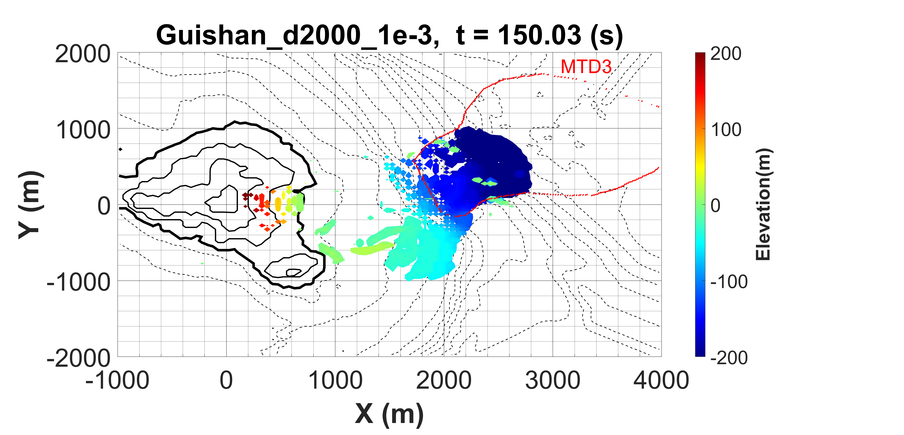
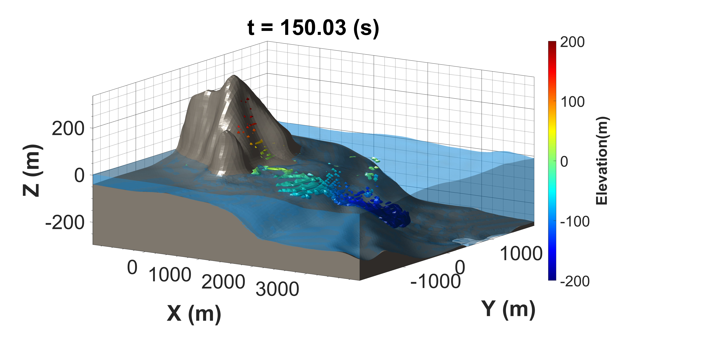
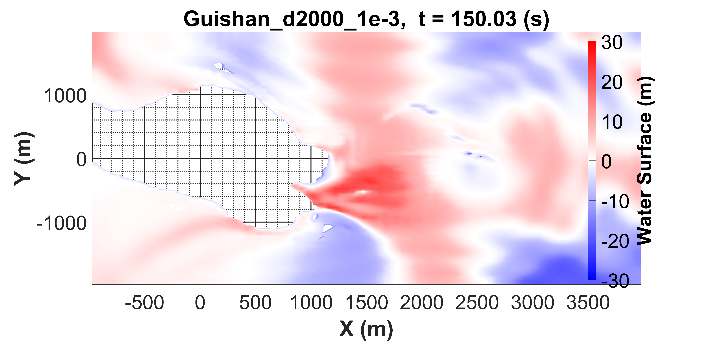

## 📂 本文關聯檔案索引
```dataview
LIST
WHERE contains(this.file.outlinks, file.link)
AND !icontains(file.name, ".png")
AND !icontains(file.name, ".jpg") 
AND !icontains(file.name, ".pdf")
AND !icontains(file.name, "excalidraw")
```

---
# 📌 摘要


---
# 🦖 以前


---
# 👨‍💻 以後


---
# 📝 內容紀錄

Guishan Landslide
mud density: 2000 kg/m $^3$
Viscosity: 1e-3

|               | 機台版                                                       | WSL                                                      |
| ------------- | --------------------------------------------------------- | -------------------------------------------------------- |
| Top view      |  |  |
| Side view     |      |      |
| Water surface |                 |            |


WSL 10CPU      0~25個 bin: 4hr 27min
160     4CPU     0~25個 bin: 14hr 6min


---
# 🔗 參考資料


---