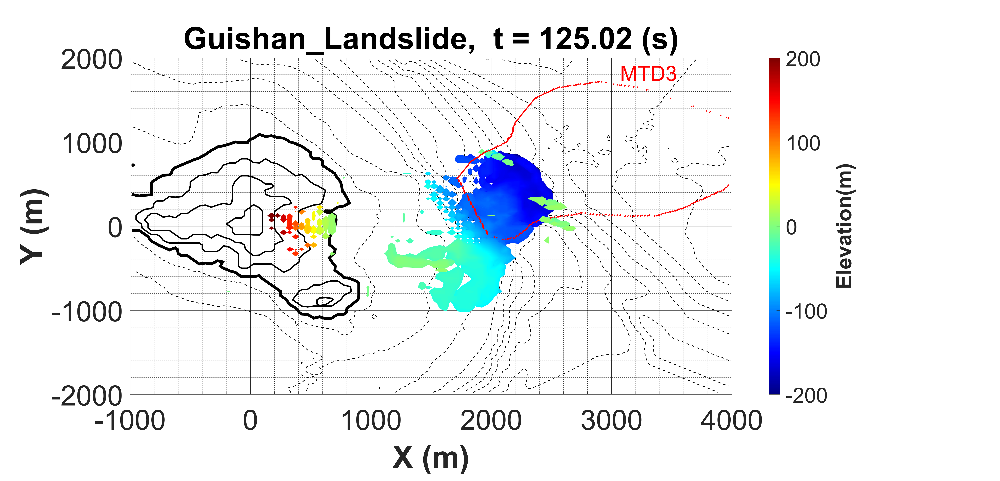
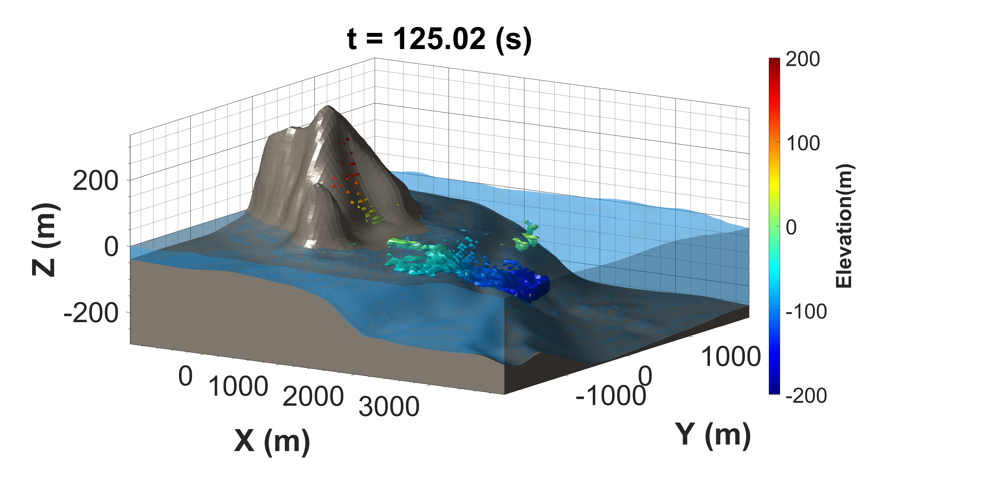
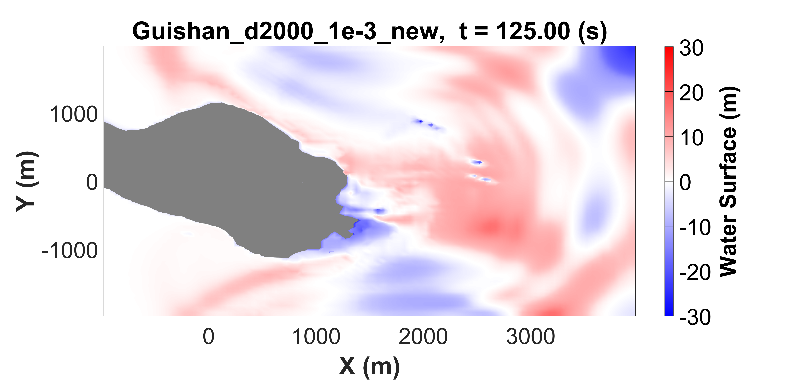
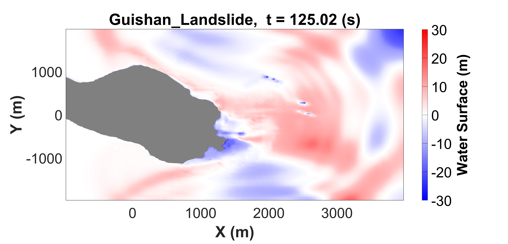
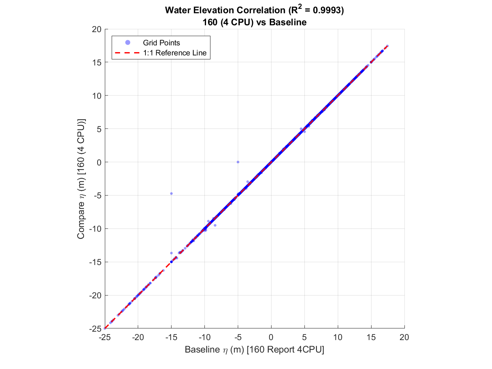
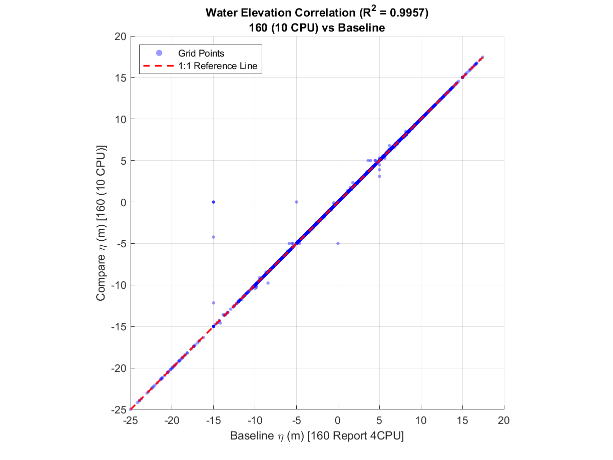
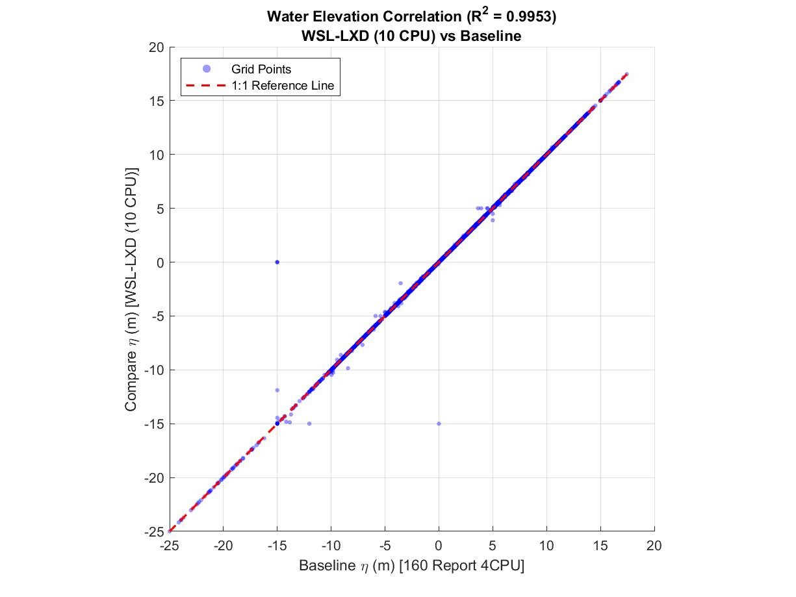
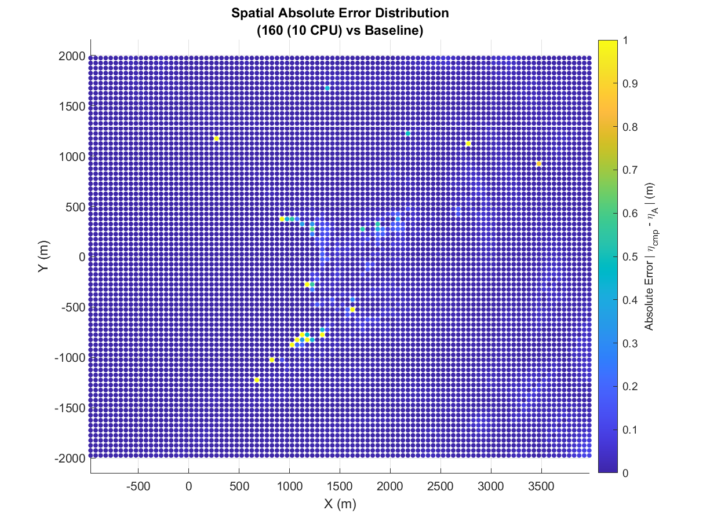
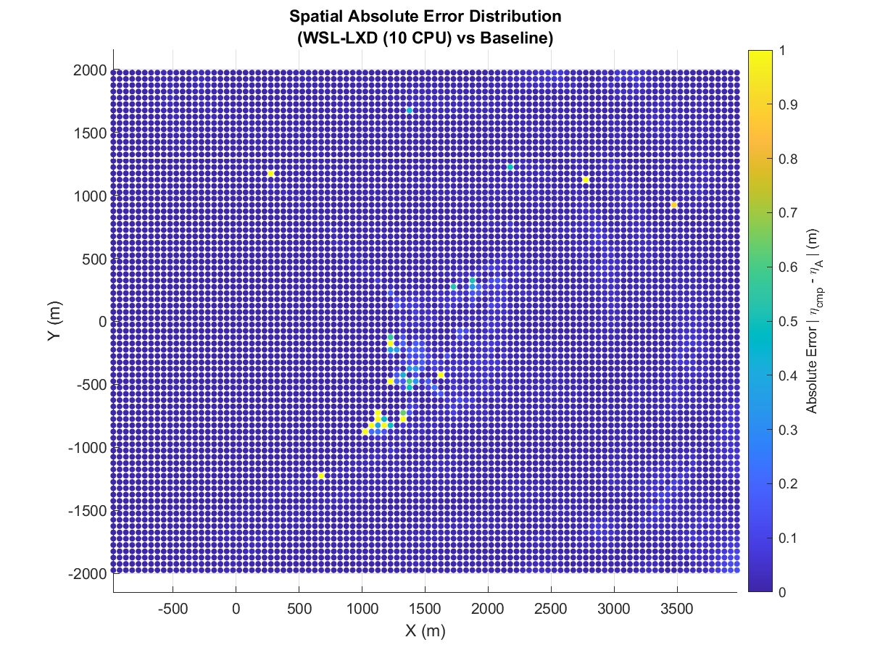
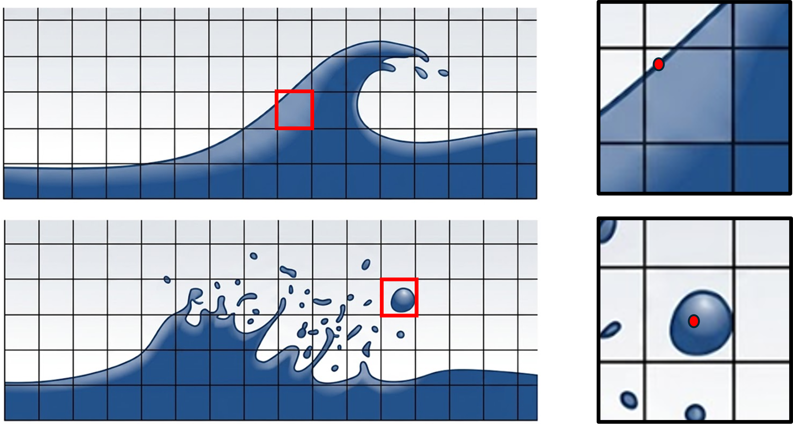

## 📂 本文關聯檔案索引
```dataview
LIST
WHERE contains(this.file.outlinks, file.link)
AND !icontains(file.name, ".png")
AND !icontains(file.name, ".jpg") 
AND !icontains(file.name, ".pdf")
AND !icontains(file.name, "excalidraw")
```

---
# 📌 摘要


---
# 🦖 以前


---
# 👨‍💻 以後


---
# 📝 內容紀錄

Guishan Landslide
mud density: 2000 kg/m $^3$
Viscosity: 1e-3
Output_Dt = 5.0 s
比較第25個 Output 檔案 (t=125.0 s)
160     4CPU      第25個 Output 檔案: 14hr 6min
160   10CPU      第25個 Output 檔案:   5hr 37min
WSL  10CPU      第25個 Output 檔案:   4hr 27min

- WSL 多核心數模擬展現出與機台160媲美的成果，並且速度上略勝一籌。
- 繪圖上 DBM-Landslide 模擬分布與軌跡基本一致。
- 數據差異主要來自 CPU 數量以及計算精度的迭代累積。
- 使用不同的CPU 數量時，水位資料數據約有 O(3) 的差異。
- WSL 與機台160所使用的CPU 數量相同時，水位資料數據約有 O(6) 的差異。
- 平行運算（MPI 核心數不同）搭配浮點數精度累積誤差造成的正常現象

|                          | 160-報告<br>(4 CPU)                                                      | 160 <br>(4 CPU)                                                           | 160<br>(10 CPU)                                                           | WSL<br>(10 CPU)                                                  |
| ------------------------ | ---------------------------------------------------------------------- | ------------------------------------------------------------------------- | ------------------------------------------------------------------------- | ---------------------------------------------------------------- |
| Runtime                  | N/A                                                                    | 14hr 6min                                                                 | 5hr 37min                                                                 | 4hr 27min                                                        |
| Top<br>view              |  |     |     |     |
| Side<br>view             |      |         |         |         |
| Water<br>surface         |   |  |  |  |
| Water<br>surface<br>data |                      |                         |                         |                |
| Scatter<br>correlation   |                                                                        |                           |                          |             |
| Spatial<br>error         |                                                                        |                                 |                                |                   |


### **算力升級與環境移轉效益驗證 (HPC & Environment Migration Benchmark)**


本分析以過往報告之機台 160 (4 CPU) 為基準 (Baseline)，評估擴充核心至 10 CPU 以及轉移至 WSL-LXD 虛擬化環境對自由水面模擬（Truchas）之精確度與算力效益。結果顯示，轉移至 WSL-LXD (10 CPU) 可將運算時間從 **14 小時 6 分鐘大幅縮短至 4 小時 27 分鐘**（計算效率提升約 3.16 倍），且全場域平均絕對誤差 (MAE) 僅為 **0.0204 m**，整體判定係數 ($R^2$) 高達 **0.9953**。超過 **99.00%** 的空間網格點位誤差低於 0.1 m，證實環境變更與平行劃分並未造成顯著的數值耗散或非物理偏置。局部最大誤差（15.0 m）集中於乾濕邊界 $(1025, -875)$，主因為自由液面捕捉機制之邊界判定差異，不影響總體水位波形場域的一致性。


This benchmark evaluates the precision and computational efficiency of migrating Truchas free-surface wave simulations from the baseline platform (Machine 160, 4 CPUs) to an expanded 10-CPU configuration and a WSL-LXD containerized environment. Results demonstrate that the WSL-LXD (10 CPU) setup dramatically reduces execution time from **14 hr 06 min to 4 hr 27 min** (achieving a 3.16x speedup). Across the 8,000 grid points, the WSL-LXD model yields a Mean Absolute Error (MAE) of merely **0.0204 m** and a coefficient of determination ($R^2$) of **0.9953**, with **99.00%** of nodes exhibiting errors under 0.1 m. The benchmark confirms that domain decomposition and OS containerization introduce negligible numerical dissipation. The isolated peak local deviation (15.0 m at grid $(1025, -875)$) stems from subtle wetting-and-drying boundary interface reconstructions rather than global physical discrepancies.




---
# 🔗 參考資料


---