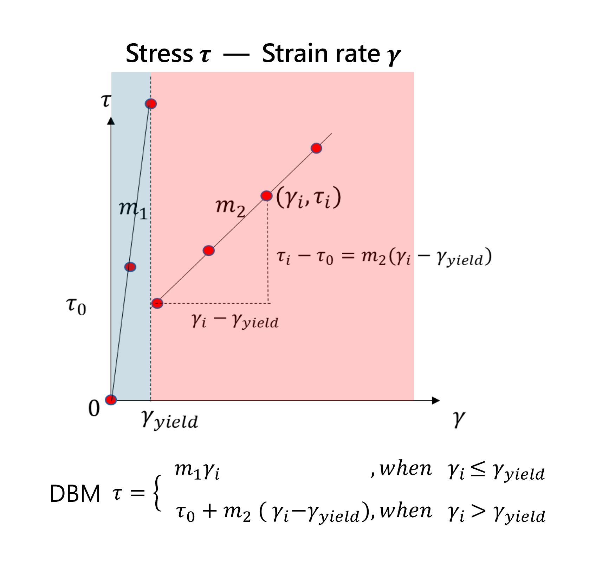
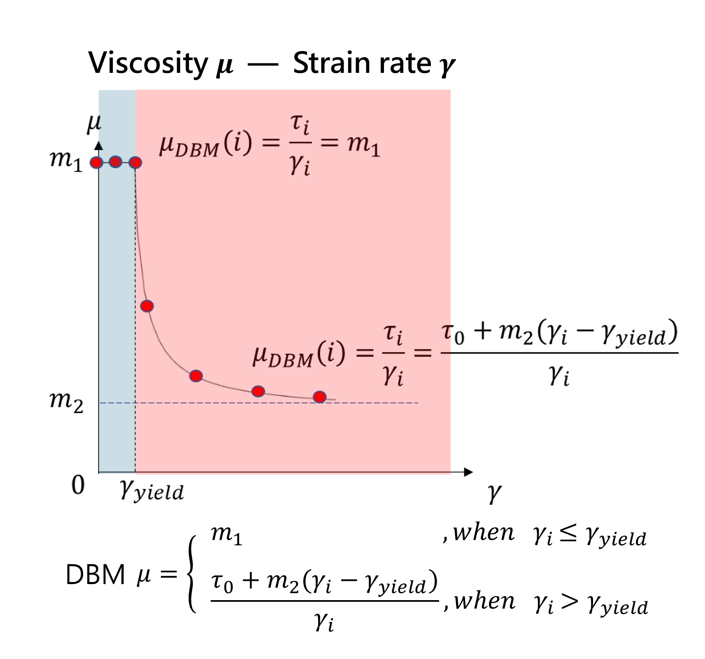

## 📂 本文關聯檔案索引
```dataview
LIST
WHERE contains(this.file.outlinks, file.link)
AND !icontains(file.name, ".png")
AND !icontains(file.name, ".jpg") 
AND !icontains(file.name, ".pdf")
AND !icontains(file.name, "excalidraw")
```

---
# 📌 摘要
- 物質承受**應力 (Shear stress)** 會產生應變，其程度可由**應變率 (Strain rate)**描述。
- 根據應力與應變率關係，流體可分為以下幾類：
	- **牛頓流體 (Newtonian Fluid):** 應力與應變率呈線性關係。
	- **賓漢流體 (Bingham Fluid):** 有一初始應力門檻，而後呈線性遞增。
	- **雙黏性流 (Bi-viscous Fluid):** 若微觀檢視賓漢流初始應力部分，其過程不應為非黑即白的瞬發開關，而是在達到應力門檻前，會有極微量的應變率產生，由於應變率過小，因此繪製成關係圖時會接近於賓漢流，微觀檢視則可視為雙黏性流，一段應變率變化極不明顯的固化區，與達應力門檻後呈現另一流變特性的液化區。
	- **不連續雙黏性流 (Discontinuous Bi-viscous):** 承上，固化區與液化區的應力交界點，可能不是完全相同的數值，可是類似動摩擦力與靜摩擦力的關係，達到臨界值前需要較大的應力，超過臨界值後則較低的應力值亦可造成應變。

- DBM 全名為 Discontinuous Bi-viscous Model，在實驗室發表的文章中被稱為 CBM (Conventional Bi-viscous Model)。
---
# 🦖 以前


---
# 👨‍💻 以後

  
流體流變特性圖


  
DBM 關係圖 (Shear stress - Strain rate)


  
DBM 關係圖 (Viscosity - Strain rate)

---
# 📝 內容紀錄

## DBM 相關程式:
- src\physics\fluid_flow\viscous\viscous_module.F90
- src\physics\fluid_flow\predictor\predictor_module.F90
- src\physics\properties\property_module.F90

---
# 🔗 參考資料


---